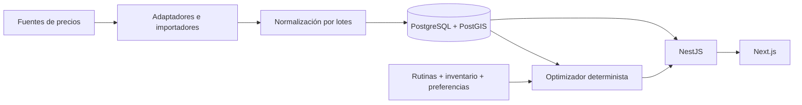

# Tus Ofertas

Aplicación web para ayudar a las personas en Argentina a gastar menos en sus compras habituales: comparar productos, registrar rutinas y despensa, y generar un cronograma de compra con ahorro estimado.

## Estado actual

Diseño inicial, monorepo Next.js/NestJS y base de datos operativa implementados (**P0-01/P1-01/P1-02**). Incluye portada adaptable, TanStack Query, API health (liveness y readiness de DB), configuración validada, errores centralizados, logging JSON, migración inicial PostgreSQL/PostGIS con constraints de dominio y pruebas de integración contra una base real. Todavía no hay autenticación, catálogo, precios reales ni optimizador en funcionamiento: las tablas existen, pero sus módulos se implementan en los pasos siguientes.

Para retomar con otro modelo o sesión, leer **[CONTINUAR.md](CONTINUAR.md)**. Los 25 pasos, sus dependencias y estado están en [ROADMAP.md](ROADMAP.md); cada fase tiene instrucciones y criterios de aceptación en [docs/steps](docs/steps/).

## Stack y arquitectura

Next.js + TypeScript + App Router + Tailwind CSS + TanStack Query; NestJS modular; PostgreSQL/PostGIS + Prisma. Desarrollo con npm workspaces y Docker Compose. Redis/BullMQ y despliegue Cloud Run se incorporan en etapas posteriores.



El dominio es independiente de SEPA y de otras fuentes externas. La primera experiencia completa usará datos ficticios claramente identificados. Ver [arquitectura](docs/ARCHITECTURE.md), [modelo de dominio](docs/DOMAIN.md) y [decisiones técnicas](docs/architecture-decisions/).

## Repositorio

```text
apps/web                 Frontend Next.js
apps/api                 API NestJS y esquema Prisma
packages/shared          Contratos compartidos
packages/ui              Componentes reutilizables
packages/config          Configuración común
docs/steps               Instrucciones de las diez fases
docs/architecture-decisions/  Decisiones y sus consecuencias
CONTINUAR.md             Estado verificado y próximo paso
ROADMAP.md               Seguimiento de los 25 pasos
docker-compose.yml       PostgreSQL/PostGIS y Redis locales
```

## Desarrollo local

Requisitos: Node 22.18+ compatible, npm 10+ y Docker Desktop con contenedores Linux. En Windows PowerShell usar `npm.cmd`/`npx.cmd` si los wrappers `.ps1` están bloqueados.

```powershell
git clone git@github.com:matiasstr/solucionadoApp.git
cd solucionadoApp
Copy-Item .env.example .env
Copy-Item apps/api/.env.example apps/api/.env
Copy-Item apps/web/.env.example apps/web/.env.local
npm.cmd ci
docker compose up -d
npm.cmd run db:generate
npm.cmd run db:deploy
npm.cmd run dev
```

Abrir [web local](http://localhost:3000), [API health](http://localhost:3001/api/health) y [readiness](http://localhost:3001/api/health/ready). `/api/health` confirma solamente que el proceso está vivo (no consulta la DB); `/api/health/ready` ejecuta una consulta real y responde 503 `{status:"unavailable"}` si PostgreSQL no está disponible. La API exige `DATABASE_URL` válida para arrancar, pero conecta de forma diferida. API usa puerto 3001, web 3000. El buscador y auth se implementan en pasos siguientes.

Servicios de datos:

```powershell
docker compose config --quiet
docker compose up -d
docker compose ps
```

Compose publica PostgreSQL en `127.0.0.1:5432` y Redis en `127.0.0.1:6379`, con volúmenes persistentes y healthchecks. Las credenciales del ejemplo son solamente para desarrollo local. `docker compose down` detiene los servicios conservando sus datos. No usar `down -v` para resolver problemas: elimina los volúmenes.

La API carga primero `.env` raíz y luego `apps/api/.env`; variables del proceso tienen precedencia. Prisma CLI carga `.env` raíz. Next carga `apps/web/.env.local`. No copiar ejemplos sobre archivos existentes con configuración propia. La disponibilidad del motor Docker queda registrada en CONTINUAR; tener el CLI instalado no acredita que los servicios estén corriendo.

## Verificaciones y build

`npm.cmd run verify` ejecuta validación/generación Prisma, typecheck, lint, tests y build. Para correr controles individuales:

```powershell
npm.cmd run typecheck
npm.cmd run lint
npm.cmd test
npm.cmd run build
npm.cmd audit
```

`npm.cmd test` no requiere DB: verifica health/readiness caído, headers, CORS, validación de entorno, errores y redacción de secretos. `npm.cmd run test:db` es la suite de integración con PostgreSQL/PostGIS real (ver abajo). Web se comprueba además por build, HTTP y revisión visual; todavía no hay suite E2E del flujo de compras.

Para ejecutar los builds, usar dos terminales: `npm.cmd run start --workspace=@tusofertas/api` y `npm.cmd run start --workspace=@tusofertas/web`. Los scripts `db:validate`, `db:generate` y `db:format` no crean tablas. Dependencias transitivas corregidas y su mantenimiento están documentadas en [ADR 0005](docs/architecture-decisions/0005-dependency-patches.md).

## Migraciones y seeds

Migración inicial: [`20260918120000_init`](apps/api/prisma/migrations/20260918120000_init/migration.sql). Se generó con `prisma migrate diff --from-empty` y se completó a mano con `CREATE EXTENSION postgis`, CHECKs de dominio, índice único `lower(email)`, trigger append-only de `ProductPrice`, trigger que deriva `Store.location` de longitud/latitud e índice GiST. Decisiones en [ADR 0006](docs/architecture-decisions/0006-database-runtime.md).

| Comando | Uso |
| --- | --- |
| `npm.cmd run db:deploy` | Aplica migraciones pendientes (`prisma migrate deploy`). Usar en entornos compartidos/producción y para preparar la DB local. |
| `npm.cmd run db:migrate` | Desarrollo: `prisma migrate dev` crea una migración nueva tras cambiar el schema (usa base shadow temporal; PostGIS se instala desde la propia migración). Revisar el SQL antes de commitear. No usar `db push`. |
| `npm.cmd run db:status` | Estado de migraciones de `DATABASE_URL`. |
| `npm.cmd run db:generate` | Genera el cliente Prisma en `apps/api/src/generated` (ignorado por Git; solo backend). |
| `npm.cmd run test:db` | Recrea la base **de prueba** `TEST_DATABASE_URL` (debe terminar en `_test`; nunca la de desarrollo), aplica migraciones dos veces (la segunda debe ser no-op), verifica que no haya drift contra el schema y corre `apps/api/test/integration`. |

Prisma no expresa CHECKs, triggers ni índices por expresión: cualquier cambio a esas reglas se hace con SQL en una migración nueva. El índice GiST sí está declarado en el schema para que `migrate dev` no lo elimine. Consultas espaciales: `StoreProximityRepository` (SQL parametrizado con `ST_DWithin` en metros).

**P2-01** implementa el seed repetible con cadenas, sucursales ficticias, productos y precios históricos; **P2-03** agrega promociones demo. No hay seeds ni precios reales disponibles todavía.

## Calidad y evolución

TypeScript strict, módulos pequeños, dinero Decimal, historial de precios inmutable y optimización determinista. Pruebas centradas en autenticación, conversiones de unidades, promociones, análisis de precios y decisiones del planificador. Cada paso se cierra con verificaciones, actualización del checkpoint, commit y push.

El objetivo completo y todos los endpoints/páginas solicitados están preservados en [REQUERIMIENTOS.md](docs/REQUERIMIENTOS.md). No confundir ahorro estimado con ahorro confirmado por una compra real.
