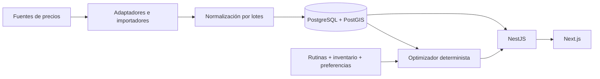

# Tus Ofertas

Aplicación web para ayudar a las personas en Argentina a gastar menos en sus compras habituales: comparar productos, registrar rutinas y despensa, y generar un cronograma de compra con ahorro estimado.

## Estado actual

Fase 1 completa (**P0-01, P1-01 a P1-04**): monorepo Next.js/NestJS, base de datos operativa y autenticación de punta a punta. Incluye portada adaptable, TanStack Query, API health (liveness y readiness de DB), configuración validada, errores centralizados, logging JSON, migración inicial PostgreSQL/PostGIS con constraints de dominio y pruebas de integración contra una base real. Se puede crear una cuenta en `/register`, ingresar en `/login`, recuperar la sesión al recargar y cerrar sesión; `/inicio` y `/bienvenida` son el área privada, honesta sobre lo que todavía falta (ver ADR [0003](docs/architecture-decisions/0003-auth-sessions.md) y [0007](docs/architecture-decisions/0007-web-auth-same-origin.md)).

**P2-01** agrega el catálogo del backend: categorías jerárquicas, productos canónicos y presentaciones concretas, cadenas y sucursales, historia de precios append-only, conversión de unidades y precio por unidad base con aritmética decimal exacta ([ADR 0008](docs/architecture-decisions/0008-catalog-prices-demo-data.md)), más un dataset **DEMO** reproducible (`npm.cmd run db:seed`). **P2-02** lo expone por HTTP: productos, canónicos, sucursales y precios actuales por sucursal, con paginación por cursor, filtros estrictos, consultas por cercanía en kilómetros y procedencia/frescura en cada precio. **P2-03** cierra la fase 2 con el motor de promociones simples (`PERCENTAGE`, `SECOND_UNIT`, `TWO_FOR_ONE`, `FIXED_PRICE`), promociones demo y `GET /promotions` ([ADR 0009](docs/architecture-decisions/0009-promotion-engine.md)). Todavía no hay comparador web, rutinas ni optimizador, y **ningún precio es real**.

Para retomar con otro modelo o sesión, leer **[CONTINUAR.md](CONTINUAR.md)**. Los 25 pasos, sus dependencias y estado están en [ROADMAP.md](ROADMAP.md); cada fase tiene instrucciones y criterios de aceptación en [docs/steps](docs/steps/).

## Stack y arquitectura

Next.js + TypeScript + App Router + Tailwind CSS + TanStack Query; NestJS modular; PostgreSQL/PostGIS + Prisma. Desarrollo con npm workspaces y Docker Compose. Redis/BullMQ y despliegue Cloud Run se incorporan en etapas posteriores.



El dominio es independiente de SEPA y de otras fuentes externas. La primera experiencia completa usará datos ficticios claramente identificados. Ver [arquitectura](docs/ARCHITECTURE.md), [modelo de dominio](docs/DOMAIN.md) y [decisiones técnicas](docs/architecture-decisions/).

## Repositorio

```text
apps/web                 Frontend Next.js
apps/api                 API NestJS y esquema Prisma
packages/shared          Contratos compartidos
packages/ui              Componentes reutilizables
packages/config          Configuración común
docs/steps               Instrucciones de las diez fases
docs/architecture-decisions/  Decisiones y sus consecuencias
CONTINUAR.md             Estado verificado y próximo paso
ROADMAP.md               Seguimiento de los 25 pasos
docker-compose.yml       PostgreSQL/PostGIS y Redis locales
```

## Desarrollo local

Requisitos: Node 22.18+ compatible, npm 10+ y Docker Desktop con contenedores Linux. En Windows PowerShell usar `npm.cmd`/`npx.cmd` si los wrappers `.ps1` están bloqueados.

```powershell
git clone git@github.com:matiasstr/solucionadoApp.git
cd solucionadoApp
Copy-Item .env.example .env
Copy-Item apps/api/.env.example apps/api/.env
Copy-Item apps/web/.env.example apps/web/.env.local
npm.cmd ci
docker compose up -d
npm.cmd run db:generate
npm.cmd run db:deploy
npm.cmd run dev
```

Abrir la [web local](http://127.0.0.1:3000) (crear cuenta en `/register`), [API health](http://localhost:3001/api/health) y [readiness](http://localhost:3001/api/health/ready). La web reenvía `/api/*` a la API (`API_ORIGIN` en `apps/web/.env.local`): el navegador usa un solo origen y la cookie de sesión es first-party. `/api/health` confirma solamente que el proceso está vivo (no consulta la DB); `/api/health/ready` ejecuta una consulta real y responde 503 `{status:"unavailable"}` si PostgreSQL no está disponible. La API exige `DATABASE_URL` válida para arrancar, pero conecta de forma diferida. API usa puerto 3001, web 3000. El buscador y auth se implementan en pasos siguientes.

Servicios de datos:

```powershell
docker compose config --quiet
docker compose up -d
docker compose ps
```

Compose publica PostgreSQL en `127.0.0.1:5432` y Redis en `127.0.0.1:6379`, con volúmenes persistentes y healthchecks. Las credenciales del ejemplo son solamente para desarrollo local. `docker compose down` detiene los servicios conservando sus datos. No usar `down -v` para resolver problemas: elimina los volúmenes.

La API carga primero `.env` raíz y luego `apps/api/.env`; variables del proceso tienen precedencia. Prisma CLI carga `.env` raíz. Next carga `apps/web/.env.local`. No copiar ejemplos sobre archivos existentes con configuración propia. La disponibilidad del motor Docker queda registrada en CONTINUAR; tener el CLI instalado no acredita que los servicios estén corriendo.

## Verificaciones y build

`npm.cmd run verify` ejecuta validación/generación Prisma, typecheck, lint, tests y build. Para correr controles individuales:

```powershell
npm.cmd run typecheck
npm.cmd run lint
npm.cmd test
npm.cmd run build
npm.cmd audit
```

`npm.cmd run test:e2e` corre el E2E de auth en Edge real (`playwright-core`, sin descargar navegadores) contra `npm.cmd run dev` ya iniciado; crea cuentas ficticias `e2e-*@example.com` en la base de desarrollo y guarda capturas en `.cache/verification/p1-04`. `npm.cmd test` no requiere DB: verifica health/readiness caído, headers, CORS, validación de entorno, errores y redacción de secretos. `npm.cmd run test:db` es la suite de integración con PostgreSQL/PostGIS real (ver abajo). Web se comprueba además por build, HTTP y revisión visual; todavía no hay suite E2E del flujo de compras.

Para ejecutar los builds, usar dos terminales: `npm.cmd run start --workspace=@tusofertas/api` y `npm.cmd run start --workspace=@tusofertas/web`. Los scripts `db:validate`, `db:generate` y `db:format` no crean tablas. Dependencias transitivas corregidas y su mantenimiento están documentadas en [ADR 0005](docs/architecture-decisions/0005-dependency-patches.md).

## API de autenticación y perfil

Prefijo `/api`. Las rutas `/auth/*` exigen `Origin` permitido y el header `X-Requested-With: tusofertas-web` (CSRF); el refresh viaja en la cookie HttpOnly `tusofertas_refresh` (path `/api/auth`), nunca en el cuerpo.

| Método y ruta | Resultado |
| --- | --- |
| `POST /auth/register` `{email, password}` | 201 `{accessToken, tokenType, expiresIn, user}` + cookie; 409 `EMAIL_TAKEN` |
| `POST /auth/login` `{email, password}` | 200 igual que registro; 401 `INVALID_CREDENTIALS` |
| `POST /auth/refresh` | 200 con token y cookie nuevos; 401 `SESSION_EXPIRED` (y borra cookie) |
| `POST /auth/logout` | 204, revoca la familia y borra cookie |
| `GET /users/me` / `PATCH /users/me` (Bearer) | Perfil y preferencias; 400 con `fields` si hay datos inválidos |

Errores: `{statusCode, error, message, fields?}`; `fields` nombra propiedades, nunca valores. Configuración en `apps/api/.env.example` (`JWT_ACCESS_SECRET` obligatorio, ≥ 32 caracteres; generar uno propio).

## API de catálogo y precios

Prefijo `/api`. Son endpoints públicos de lectura (no requieren sesión). Contratos en [`packages/shared/src/index.ts`](packages/shared/src/index.ts): decimales como texto, fechas ISO 8601 en UTC y ninguna entidad Prisma expuesta tal cual.

| Método y ruta | Resultado |
| --- | --- |
| `GET /products?search=&categoryId=&canonicalProductId=&limit=&cursor=` | Página de presentaciones concretas |
| `GET /products/:id` | Producto con su categoría y su canónico |
| `GET /products/:id/prices?latitude=&longitude=&radiusKm=&city=&province=&includeStale=` | Precio actual por sucursal, del más barato por unidad base al más caro |
| `GET /canonical-products?search=&categoryId=&limit=&cursor=` | Página de necesidades equivalentes |
| `GET /canonical-products/:id` | Canónico con sus alternativas |
| `GET /stores?search=&chainId=&city=&province=&latitude=&longitude=&radiusKm=&limit=&cursor=` | Sucursales; con coordenadas ordena por distancia |
| `GET /stores/:id` | Sucursal |
| `GET /promotions?storeId=&chainId=&productId=&canonicalProductId=&type=&activeAt=&includeInactive=&limit=&cursor=` | Promociones; por defecto solo las vigentes ahora |
| `GET /promotions/:id` | Promoción con su alcance, condiciones y vigencia |

Reglas de estos endpoints:

- **Paginación por cursor**, no por número de página: `page.nextCursor` es opaco y `null` cuando no hay más. `limit` va de 1 a 50 (20 por defecto). Insertar filas no saltea ni repite resultados. La búsqueda por cercanía ordena por distancia y no admite cursor.
- **Filtros estrictos**: un parámetro desconocido o fuera de rango responde `400 VALIDATION_FAILED` con `fields`. Un id mal formado es `400`, no `404`.
- **Distancias solo con coordenadas.** `radiusKm` (0,1 a 100) exige latitud y longitud; se convierte a metros para PostGIS. Por localidad (`city` + `province`) se listan sucursales con `distanceMeters: null`: sin ubicación precisa no se inventa una distancia. `scope` informa cuál de los tres alcances se aplicó (`COORDINATES`, `LOCALITY`, `ALL`).
- **Todo precio viaja con procedencia**: `source`, `freshness.observedAt`, `ageDays` y `isStale`. Los precios viejos se muestran marcados, salvo que se pida `includeStale=false`.

Ejemplo real contra el dataset DEMO (`GET /api/products/<id>/prices?latitude=-34.6187&longitude=-58.4407&radiusKm=5`, recortado a una sucursal):

```json
{
  "product": { "id": "43d81156-…", "name": "Arroz largo fino Pampa 1 kg (DEMO)", "quantity": "1", "unit": "KG" },
  "scope": { "origin": "COORDINATES", "radiusKm": 5, "distancesAvailable": true, "storesConsidered": 3, "maxAgeDays": 7, "includeStale": true },
  "prices": [
    {
      "store": { "id": "331b0ba2-…", "chainName": "Vea", "name": "Vea Flores (DEMO)", "city": "Ciudad Autónoma de Buenos Aires", "distanceMeters": 2372.74540579 },
      "price": "1267.57",
      "currency": "ARS",
      "unitPrice": "1267.570000",
      "unitPriceUnit": "KG",
      "unitPricePer100g": "126.757000",
      "source": "demo-seed",
      "freshness": { "observedAt": "2026-09-21T12:00:00.000Z", "ageDays": 0, "maxAgeDays": 7, "isStale": false }
    }
  ]
}
```

Los importes de ese ejemplo son **ficticios** (`source: "demo-seed"`): no son precios reales de esa cadena.

## Promociones

Cuatro tipos calculables: `PERCENTAGE` (porcentaje sobre las unidades elegibles), `SECOND_UNIT` (una unidad con descuento por cada par completo), `TWO_FOR_ONE` (se cobran `cantidad - floor(cantidad / 2)`) y `FIXED_PRICE` (precio final por unidad al alcanzar la cantidad mínima). `BANK_DISCOUNT` está modelado pero **no se aplica** hasta P10-01. Decisiones en [ADR 0009](docs/architecture-decisions/0009-promotion-engine.md).

El calculador vive en el dominio (`priceLine`), no en la API: recibe precio unitario, cantidad y modalidad de venta, y devuelve el total, el ahorro y **la evaluación de cada promoción considerada, aplique o no**. Reglas que sostiene:

- **Una sola promoción por línea**: la que más conviene al comprador; ante igual ahorro gana el id más chico. `isStackable` todavía no habilita acumulación.
- **Lo que no se puede comprobar no se aplica, pero se informa** con su motivo: banco o medio de pago (`PAYMENT_CONDITIONED`), membresía, mínimo de compra sin subtotal conocido, topes que abarcan varias compras, o un cálculo que no mejora el precio regular.
- **Las promociones por pares exigen unidades enteras** del mismo producto: no aplican a venta por peso. Un envasado se compra entero y el excedente se muestra (`planPurchase`).
- **Vigencia `[validFrom, validUntil)`** sobre instantes UTC, pero los días elegibles se leen en `America/Argentina/Buenos_Aires`: un domingo a las 21:00 en Argentina es lunes en UTC y vale el día argentino.
- **El redondeo monetario ocurre una sola vez**, sobre el total de la línea.

`GET /promotions` informa; no afirma que a quien consulta le corresponda el beneficio. El campo `automatic` distingue las que el sistema calcula solo de las que dependen del usuario o de compras previas. El seed carga 9 promociones demo: activas, una futura, una vencida, una solo los martes, una con mínimo de compra y una bancaria que nunca se aplica sola.

## Deploy

La web está publicada en **https://tusofertas.vercel.app** (Vercel, root `apps/web`, install `cd ../.. && npm ci --include=dev`). La API y la base todavía no están desplegadas: sin `API_ORIGIN` la web informa que el servicio no está disponible. Redeploy manual: `vercel deploy --prod` desde la raíz del repo. Detalles y pasos pendientes en [CONTINUAR.md](CONTINUAR.md#deploy-vercel--solo-la-web).

## Migraciones y seeds

Migración inicial: [`20260918120000_init`](apps/api/prisma/migrations/20260918120000_init/migration.sql). Se generó con `prisma migrate diff --from-empty` y se completó a mano con `CREATE EXTENSION postgis`, CHECKs de dominio, índice único `lower(email)`, trigger append-only de `ProductPrice`, trigger que deriva `Store.location` de longitud/latitud e índice GiST. Decisiones en [ADR 0006](docs/architecture-decisions/0006-database-runtime.md).

| Comando | Uso |
| --- | --- |
| `npm.cmd run db:deploy` | Aplica migraciones pendientes (`prisma migrate deploy`). Usar en entornos compartidos/producción y para preparar la DB local. |
| `npm.cmd run db:migrate` | Desarrollo: `prisma migrate dev` crea una migración nueva tras cambiar el schema (usa base shadow temporal; PostGIS se instala desde la propia migración). Revisar el SQL antes de commitear. No usar `db push`. |
| `npm.cmd run db:status` | Estado de migraciones de `DATABASE_URL`. |
| `npm.cmd run db:generate` | Genera el cliente Prisma en `apps/api/src/generated` (ignorado por Git; solo backend). |
| `npm.cmd run test:db` | Recrea la base **de prueba** `TEST_DATABASE_URL` (debe terminar en `_test`; nunca la de desarrollo), aplica migraciones dos veces (la segunda debe ser no-op), verifica que no haya drift contra el schema y corre `apps/api/test/integration`. |
| `npm.cmd run db:seed` | Carga el dataset **DEMO** (P2-01) en `DATABASE_URL`. Opciones: `-- --anchor=AAAA-MM-DD --days=31`. Repetible: no duplica ni borra nada. |

Prisma no expresa CHECKs, triggers ni índices por expresión: cualquier cambio a esas reglas se hace con SQL en una migración nueva. El índice GiST sí está declarado en el schema para que `migrate dev` no lo elimine. Consultas espaciales: `StoreProximityRepository` (SQL parametrizado con `ST_DWithin` en metros).

### Dataset DEMO

`npm.cmd run db:seed` carga 7 categorías, 18 productos canónicos, 28 presentaciones, 5 cadenas, 10 sucursales y ~7.200 observaciones de precio (31 días). **Los nombres de las cadenas son reales; las sucursales, marcas, productos y todos los precios son inventados**: llevan el sufijo `(DEMO)` y sus observaciones usan `source = 'demo-seed'` e `importBatchId = demo-seed:<fecha ancla>`. Nunca deben presentarse como una consulta real.

El dataset incluye a propósito casos difíciles: misma necesidad en varias presentaciones (arroz 1 kg vs 500 g), packs cuyo contenido total ya está en `quantity` (6 × 2,25 L = 13,5 L), venta por peso (queso, banana, pollo), una sucursal sin coordenadas (solo localidad, no habilita distancias), una que informa día por medio y otra que dejó de informar hace 12 días.

Es idempotente: los ids son UUID v5 deterministas y cada observación tiene la clave `demo:<producto>:<sucursal>:<día>`, así que correrlo dos veces con la misma fecha ancla inserta cero filas. Usar `--anchor` fija el día del precio más reciente para que las pruebas no caduquen. No se ejecuta con `NODE_ENV=production` ni contra una base remota sin `SEED_ALLOW_REMOTE=true`, y nunca borra datos del usuario.

```bash
npm.cmd run db:deploy
npm.cmd run db:seed -- --anchor=2026-09-18 --days=31
```

### Unidades, precio por unidad base y frescura

Los importes y las cantidades se calculan con decimales exactos (`DecimalValue`, entero escalado con redondeo HALF_UP) y viajan como texto; nunca se usa `number` para dinero. `unitPrice = price / contenido en unidad base`: `1000 G = 1 KG`, `1000 ML = 1 L`, y no existe conversión entre masa, volumen y unidades. El precio por 100 g es una presentación del precio por KG (÷10), no una dimensión nueva.

| Presentación | Precio | Precio por unidad base |
| --- | --- | --- |
| Arroz 1 kg | 1290,00 | 1290,000000 / KG |
| Arroz 500 g | 720,00 | 1440,000000 / KG |
| Aceite 900 ml | 2890,00 | 3211,111111 / L |
| Pack 6 × 2,25 L (13,5 L) | 13900,00 | 1029,629630 / L |
| Docena de huevos (12 UNIT) | 3890,00 | 324,166667 / UNIT |

El normalizador rechaza en vez de corregir en silencio: precios con más de dos decimales, cantidades con más de cuatro, valores cero o negativos, venta por peso con unidad de conteo y productos cuya dimensión no coincide con la de su canónico.

El precio actual de un producto en una sucursal es su observación más reciente; los empates se resuelven por precedencia de fuente (`PRICE_SOURCE_PRECEDENCE`), fecha de ingesta, nombre de fuente e id. Pasados `PRICE_MAX_AGE_DAYS` días (7 por defecto) la observación se marca desactualizada, **pero se sigue mostrando con su fecha y su fuente**: un precio viejo no es disponibilidad garantizada. La historia es append-only; un trigger de la base rechaza `UPDATE` y `DELETE`.

**P2-02** expone estos datos por HTTP y **P2-03** agrega promociones demo. No hay precios reales disponibles todavía.

## Calidad y evolución

TypeScript strict, módulos pequeños, dinero Decimal, historial de precios inmutable y optimización determinista. Pruebas centradas en autenticación, conversiones de unidades, promociones, análisis de precios y decisiones del planificador. Cada paso se cierra con verificaciones, actualización del checkpoint, commit y push.

El objetivo completo y todos los endpoints/páginas solicitados están preservados en [REQUERIMIENTOS.md](docs/REQUERIMIENTOS.md). No confundir ahorro estimado con ahorro confirmado por una compra real.
