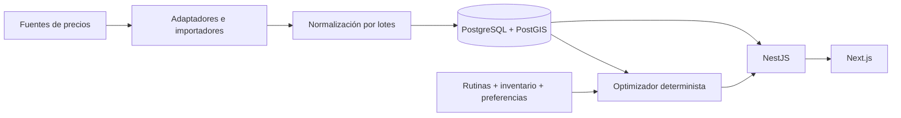

# Tus Ofertas

Aplicación web para ayudar a las personas en Argentina a gastar menos en sus compras habituales: comparar productos, registrar rutinas y despensa, y generar un cronograma de compra con ahorro estimado.

## Estado actual

Diseño inicial y planificación preparados. El monorepo ejecutable comienza en **P1-01**. Todavía no hay autenticación, catálogo, precios reales ni optimizador en funcionamiento. El esquema Prisma modela las etapas siguientes; no se ha aplicado a una base de datos.

Para retomar con otro modelo o sesión, leer **[CONTINUAR.md](CONTINUAR.md)**. Los 25 pasos, sus dependencias y estado están en [ROADMAP.md](ROADMAP.md); cada fase tiene instrucciones y criterios de aceptación en [docs/steps](docs/steps/).

## Stack y arquitectura

Next.js + TypeScript + App Router + Tailwind CSS + TanStack Query; NestJS modular; PostgreSQL/PostGIS + Prisma. Desarrollo con npm workspaces y Docker Compose. Redis/BullMQ y despliegue Cloud Run se incorporan en etapas posteriores.



El dominio es independiente de SEPA y de otras fuentes externas. La primera experiencia completa usará datos ficticios claramente identificados. Ver [arquitectura](docs/ARCHITECTURE.md), [modelo de dominio](docs/DOMAIN.md) y [decisiones técnicas](docs/architecture-decisions/).

## Repositorio

```text
apps/web                 Frontend Next.js (P1-01)
apps/api                 API NestJS y esquema Prisma
packages/shared          Contratos compartidos (P1-01)
packages/ui              Componentes reutilizables (P1-01)
packages/config          Configuración común (P1-01)
docs/steps               Instrucciones de las diez fases
docs/architecture-decisions/  Decisiones y sus consecuencias
CONTINUAR.md             Estado verificado y próximo paso
ROADMAP.md               Seguimiento de los 25 pasos
docker-compose.yml       PostgreSQL/PostGIS y Redis locales
```

## Desarrollo local

Requisitos: Node 22.18+ compatible, npm 10+ y Docker Desktop con contenedores Linux. En Windows PowerShell usar `npm.cmd`/`npx.cmd` si los wrappers `.ps1` están bloqueados.

```powershell
cd C:\Users\PC\Desktop\TusOfertasApp\solucionadoApp
Copy-Item .env.example .env
docker compose config --quiet
docker compose up -d
docker compose ps
```

Compose publica PostgreSQL en `127.0.0.1:5432` y Redis en `127.0.0.1:6379`, con volúmenes persistentes y healthchecks. Las credenciales del ejemplo son solamente para desarrollo local. `docker compose down` detiene los servicios conservando sus datos. No usar `down -v` para resolver problemas: elimina los volúmenes.

Los comandos de instalación y ejecución de aplicaciones se agregan y verifican al cerrar P1-01. La disponibilidad del motor Docker queda registrada en CONTINUAR; tener el CLI instalado no acredita que los servicios estén corriendo.

## Migraciones y seeds

El [schema inicial](apps/api/prisma/schema.prisma) todavía no tiene migraciones. **P1-02** crea y prueba la migración SQL, PostGIS, índices y constraints. **P2-01** implementa el seed repetible con cadenas, sucursales ficticias, productos y precios históricos; **P2-03** agrega promociones demo. No hay seeds ni precios reales disponibles todavía.

## Calidad y evolución

TypeScript strict, módulos pequeños, dinero Decimal, historial de precios inmutable y optimización determinista. Pruebas centradas en autenticación, conversiones de unidades, promociones, análisis de precios y decisiones del planificador. Cada paso se cierra con verificaciones, actualización del checkpoint, commit y push.

El objetivo completo y todos los endpoints/páginas solicitados están preservados en [REQUERIMIENTOS.md](docs/REQUERIMIENTOS.md). No confundir ahorro estimado con ahorro confirmado por una compra real.
