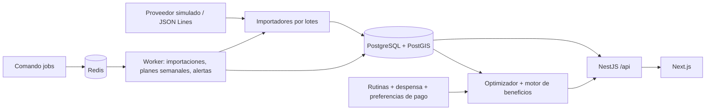

# Tus Ofertas

Aplicación web para ayudar a las personas en Argentina a gastar menos en sus compras habituales: comparar productos, registrar rutinas y despensa, y generar un cronograma de compra con ahorro estimado.

## Estado actual

Fase 1 completa (**P0-01, P1-01 a P1-04**): monorepo Next.js/NestJS, base de datos operativa y autenticación de punta a punta. Incluye portada adaptable, TanStack Query, API health (liveness y readiness de DB), configuración validada, errores centralizados, logging JSON, migración inicial PostgreSQL/PostGIS con constraints de dominio y pruebas de integración contra una base real. Se puede crear una cuenta en `/register`, ingresar en `/login`, recuperar la sesión al recargar y cerrar sesión; `/inicio` es el área privada, honesta sobre lo que todavía falta (ver ADR [0003](docs/architecture-decisions/0003-auth-sessions.md) y [0007](docs/architecture-decisions/0007-web-auth-same-origin.md)).

**P2-01** agrega el catálogo del backend: categorías jerárquicas, productos canónicos y presentaciones concretas, cadenas y sucursales, historia de precios append-only, conversión de unidades y precio por unidad base con aritmética decimal exacta ([ADR 0008](docs/architecture-decisions/0008-catalog-prices-demo-data.md)), más un dataset **DEMO** reproducible (`npm.cmd run db:seed`). **P2-02** lo expone por HTTP: productos, canónicos, sucursales y precios actuales por sucursal, con paginación por cursor, filtros estrictos, consultas por cercanía en kilómetros y procedencia/frescura en cada precio. **P2-03** cierra la fase 2 con el motor de promociones simples (`PERCENTAGE`, `SECOND_UNIT`, `TWO_FOR_ONE`, `FIXED_PRICE`), promociones demo y `GET /promotions` ([ADR 0009](docs/architecture-decisions/0009-promotion-engine.md)). **P3-01** agrega la búsqueda (nombre, marca o EAN, con filtros de cadena, localidad y radio) y la comparación de alternativas por unidad base con sus promociones: el formato completo de las respuestas está en [docs/API.md](docs/API.md). **P3-02** cierra la fase 3 con las pantallas: portada con buscador, `/buscar` y `/producto/[id]`, todas públicas y con los filtros en la URL. **P4-01** agrega la API privada de rutinas de compra y despensa, con ownership en cada consulta y cantidades normalizadas a la unidad del canónico ([ADR 0011](docs/architecture-decisions/0011-routines-inventory-ownership.md)); **P4-02** cierra la fase 4 con las pantallas privadas: onboarding (`/onboarding`), compras habituales (`/mis-compras`), despensa (`/mi-despensa`) y preferencias (`/preferencias`) ([ADR 0012](docs/architecture-decisions/0012-onboarding-private-pages.md)). **P5-01** abre la fase 5 con el cálculo de necesidades netas y candidatos de compra del planificador ([ADR 0013](docs/architecture-decisions/0013-planner-needs-candidates.md)) , **P5-02** agrega el optimizador determinista con costo efectivo, base habitual y ahorro estimado ([ADR 0014](docs/architecture-decisions/0014-planner-optimizer.md)) y **P5-03** cierra la fase 5: planes guardados con `/shopping-plans` y la pantalla `/plan-semanal` con el cronograma por día y sucursal ([ADR 0015](docs/architecture-decisions/0015-saved-plans.md)). **P6-01** agrega el historial de precios por sucursal y fuente con su análisis (normal, buena oferta, caro, mínimo de la ventana, desactualizado o datos insuficientes) en `GET /products/:id/price-history` ([ADR 0016](docs/architecture-decisions/0016-price-history-analysis.md)) y **P6-02** cierra la fase 6: el historial se ve como gráfico en `/producto/[id]` y el resumen privado `/dashboard` muestra próxima compra, ahorro **estimado** (un plan por período) y oportunidades en los productos habituales ([ADR 0017](docs/architecture-decisions/0017-dashboard-estimated-savings.md)). **P7-01** abre la fase 7 con la arquitectura de importación: contratos de proveedores, normalización estricta, identidad por fuente y EAN, lotes con backpressure y un comando manual con un proveedor simulado y otro de archivo ([ADR 0018](docs/architecture-decisions/0018-import-pipeline.md)), y **P7-02** la cierra con ejecuciones registradas, cuarentena, reintentos, reanudación y descargas solo de hosts permitidos ([ADR 0019](docs/architecture-decisions/0019-import-runs-recovery.md), guía para proveedores en [docs/IMPORTS.md](docs/IMPORTS.md)); todavía no hay una fuente real conectada. **P8-01** abre la fase 8 con jobs en Redis/BullMQ: un worker aparte del API HTTP procesa importaciones de precios y promociones y la generación de planes semanales, con ids idempotentes, reintentos y comandos manuales ([ADR 0020](docs/architecture-decisions/0020-jobs-bullmq-worker.md)); **P8-02** cierra la fase 8: programaciones en hora argentina sin duplicados entre réplicas, reporte operativo (retraso de colas, último éxito por fuente, ejecuciones colgadas, frescura de precios), fallos agotados con reintento manual seguro, imágenes Docker y [runbook](docs/RUNBOOK.md) ([ADR 0021](docs/architecture-decisions/0021-job-scheduling-operations.md)); el worker todavía no está desplegado. **P9-01** abre la fase 9 con alertas de precio (objetivo por unidad, mínimo del mes o buena oferta) y una bandeja de avisos dentro de la app: API `/alerts` y `/notifications` y job `CHECK_PRICE_ALERTS` que avisa sin repetir ni duplicar ([ADR 0022](docs/architecture-decisions/0022-price-alerts-notifications.md)), y **P9-02** cierra la fase 9 con las pantallas: crear alertas desde el producto y el buscador, bandeja en `/alertas`, contador en el menú y últimos avisos en el resumen. **P10-01** abre la fase 10 con los beneficios de pago: monto fijo o porcentaje, descuento en caja o reintegro con plazo, topes por compra, semana, mes o campaña compartidos entre promociones, elegibilidad según los bancos y medios declarados (sin pedir datos de tarjeta) y `POST /benefits/evaluate`, que explica qué aplica, qué está condicionado y qué no corresponde ([ADR 0023](docs/architecture-decisions/0023-payment-benefits-engine.md)). **P10-02** cierra la fase 10 y el producto. El plan cobra cada visita como una compra con esos beneficios: pagar hoy, reintegro estimado y costo después del reintegro, sin contar reintegros como ahorro. El comparador muestra los beneficios de banco con sus condiciones. Preferencias y onboarding permiten declarar medios de pago e informar topes ya usados. El resumen y las alertas analizan todas las series de la zona sin tope oculto ([ADR 0024](docs/architecture-decisions/0024-plan-payment-benefits.md), [ADR 0025](docs/architecture-decisions/0025-price-queries-at-scale.md)). **Ningún precio es real** y el ahorro siempre es **estimado**.

**Qué está demostrado y qué falta.** Las diez fases funcionales están implementadas y probadas con datos **DEMO** (seed) y **MOCK** (importador simulado): unitarios, integración con PostgreSQL/PostGIS y Redis reales, E2E en Edge del recorrido registro → rutina → despensa → comparación → historial → alerta → medios de pago → plan, y un benchmark local con ~259.000 precios ([RUNBOOK](docs/RUNBOOK.md#tiempos-de-respuesta-benchmark-local)). Siguen pendientes, como trabajo aparte:
- **Fuente real de precios y promociones**: los conectores implementados son el proveedor simulado y archivos o descargas JSON Lines.
- **Worker y Redis desplegados**: sin ellos, en producción no corren importaciones programadas, planes semanales ni alertas.
- **Redespliegue de producción**: tiene todo hasta P8-01.
- **Avisos fuera de la app**: no hay email ni push.

Para retomar con otro modelo o sesión, leer **[CONTINUAR.md](CONTINUAR.md)**. Los 25 pasos, sus dependencias y estado están en [ROADMAP.md](ROADMAP.md); cada fase tiene instrucciones y criterios de aceptación en [docs/steps](docs/steps/).

## Stack y arquitectura

Next.js + TypeScript + App Router + Tailwind CSS + TanStack Query; NestJS modular; PostgreSQL/PostGIS + Prisma; Redis + BullMQ para jobs en un worker aparte del API HTTP. Desarrollo con npm workspaces y Docker Compose. Web y API publicadas en Vercel con Supabase; el worker está preparado (imagen y runbook) pero no desplegado.


```mermaid
flowchart LR
  Sources[Proveedor simulado / JSON Lines] --> Importers[Importadores por lotes]
  Importers --> DB[(PostgreSQL + PostGIS)]
  Jobs[Comando jobs] --> Redis[(Redis)]
  Redis --> Worker[Worker: importaciones, planes semanales, alertas]
  Worker --> Importers
  Worker --> DB
  DB --> API[NestJS /api]
  API --> Web[Next.js]
  Needs[Rutinas + despensa + preferencias de pago] --> Optimizer[Optimizador + motor de beneficios]
  DB --> Optimizer
  Optimizer --> API
```

El dominio es independiente de SEPA y de otras fuentes externas. La primera experiencia completa usará datos ficticios claramente identificados. Ver [arquitectura](docs/ARCHITECTURE.md), [modelo de dominio](docs/DOMAIN.md) y [decisiones técnicas](docs/architecture-decisions/).

## Repositorio

```text
apps/web                 Frontend Next.js
apps/api                 API NestJS y esquema Prisma
packages/shared          Contratos compartidos
packages/ui              Componentes reutilizables
packages/config          Configuración común
docs/steps               Instrucciones de las diez fases
docs/architecture-decisions/  Decisiones y sus consecuencias
CONTINUAR.md             Estado verificado y próximo paso
ROADMAP.md               Seguimiento de los 25 pasos
docker-compose.yml       PostgreSQL/PostGIS y Redis locales
```

## Desarrollo local

Requisitos: Node 22.18+ compatible, npm 10+ y Docker Desktop con contenedores Linux. En Windows PowerShell usar `npm.cmd`/`npx.cmd` si los wrappers `.ps1` están bloqueados.

```powershell
git clone git@github.com:matiasstr/solucionadoApp.git
cd solucionadoApp
Copy-Item .env.example .env
Copy-Item apps/api/.env.example apps/api/.env
Copy-Item apps/web/.env.example apps/web/.env.local
npm.cmd ci
docker compose up -d
npm.cmd run db:generate
npm.cmd run db:deploy
npm.cmd run dev
```

Abrir la [web local](http://127.0.0.1:3000) (crear cuenta en `/register`), [API health](http://localhost:3001/api/health) y [readiness](http://localhost:3001/api/health/ready). La web reenvía `/api/*` a la API (`API_ORIGIN` en `apps/web/.env.local`): el navegador usa un solo origen y la cookie de sesión es first-party. `/api/health` confirma solamente que el proceso está vivo (no consulta la DB); `/api/health/ready` ejecuta una consulta real y responde 503 `{status:"unavailable"}` si PostgreSQL no está disponible. La API exige `DATABASE_URL` válida para arrancar, pero conecta de forma diferida. API usa puerto 3001, web 3000. Para ver precios hace falta el dataset DEMO (`npm.cmd run db:seed`).

Servicios de datos:

```powershell
docker compose config --quiet
docker compose up -d
docker compose ps
```

Compose publica PostgreSQL en `127.0.0.1:5432` y Redis en `127.0.0.1:6379`, con volúmenes persistentes y healthchecks. Las credenciales del ejemplo son solamente para desarrollo local. `docker compose down` detiene los servicios conservando sus datos. No usar `down -v` para resolver problemas: elimina los volúmenes.

La API carga primero `.env` raíz y luego `apps/api/.env`; variables del proceso tienen precedencia. Prisma CLI carga `.env` raíz. Next carga `apps/web/.env.local`. No copiar ejemplos sobre archivos existentes con configuración propia. La disponibilidad del motor Docker queda registrada en CONTINUAR; tener el CLI instalado no acredita que los servicios estén corriendo.

## Verificaciones y build

`npm.cmd run verify` ejecuta validación/generación Prisma, typecheck, lint, tests y build. Para correr controles individuales:

```powershell
npm.cmd run typecheck
npm.cmd run lint
npm.cmd test
npm.cmd run build
npm.cmd audit
```

`npm.cmd run test:e2e` corre los E2E de auth, de búsqueda/comparación, de cuenta (onboarding, compras, despensa y preferencias), de plan, de historial, de alertas y el recorrido completo con beneficios de pago (`journey.e2e.cjs`: registro, medios de pago, rutina, despensa, comparación, historial, alerta, topes usados, plan y móvil) en Edge real (`playwright-core`, sin descargar navegadores) contra `npm.cmd run dev` ya iniciado; el de búsqueda necesita `npm.cmd run db:seed` y no escribe datos, el de auth y el de cuenta crean cuentas ficticias `e2e-*@example.com`. Las capturas quedan en `.cache/verification/` (por paso, por ejemplo `p10-02`). Los tiempos de respuesta con un dataset grande se miden con `apps/api/scripts/bench-api.cjs` ([RUNBOOK](docs/RUNBOOK.md#tiempos-de-respuesta-benchmark-local)). Con la API o la web en otro puerto, definir `E2E_BASE_URL`. `npm.cmd test` no requiere DB: verifica health/readiness caído, headers, CORS, validación de entorno, errores y redacción de secretos. `npm.cmd run test:db` es la suite de integración con PostgreSQL/PostGIS y Redis reales (ver abajo). Web se comprueba además por build y revisión visual de esas capturas.

Para ejecutar los builds, usar dos terminales: `npm.cmd run start --workspace=@tusofertas/api` y `npm.cmd run start --workspace=@tusofertas/web`. Los scripts `db:validate`, `db:generate` y `db:format` no crean tablas. Dependencias transitivas corregidas y su mantenimiento están documentadas en [ADR 0005](docs/architecture-decisions/0005-dependency-patches.md).

## Catálogo de endpoints

Todas las rutas van con el prefijo `/api`. El formato estable de cada respuesta está en **[docs/API.md](docs/API.md)**, y los contratos en [`packages/shared`](packages/shared/src/index.ts).

| Grupo | Rutas | Sesión |
| --- | --- | --- |
| Salud | `GET /health`, `GET /health/ready` | No |
| Autenticación y perfil | `POST /auth/register\|login\|refresh\|logout`, `GET/PATCH /users/me` (zona, distancia, sucursales, medios de pago, bancos, membresías) | `/auth` con CSRF; perfil con Bearer |
| Catálogo y búsqueda | `GET /products`, `/products/:id`, `/canonical-products`, `/canonical-products/:id` | No |
| Precios y comparación | `GET /products/:id/prices`, `/products/:id/price-history`, `/canonical-products/:id/prices` (con `promotion` y `paymentBenefits` por oferta) | No |
| Comercios y promociones | `GET /stores`, `/stores/:id`, `/promotions`, `/promotions/:id` | No |
| Beneficios de pago | `POST /benefits/evaluate`, `GET /benefit-usage`, `PUT/DELETE /benefit-usage/:promotionId` | Bearer |
| Rutinas y despensa | `/shopping-routines` (+ `/:id`, `/:id/items`, `/:id/items/:itemId`), `/inventory` (+ `/:id`) | Bearer |
| Planes | `POST /shopping-plans/generate` (con `Idempotency-Key`), `GET /shopping-plans`, `GET/PATCH /shopping-plans/:id` | Bearer |
| Resumen | `GET /dashboard` | Bearer |
| Alertas y avisos | `GET/POST /alerts`, `PATCH/DELETE /alerts/:id`, `GET /notifications`, `PATCH /notifications/:id/read` | Bearer |

Los jobs (importaciones, planes semanales, alertas) se operan por comando, no por HTTP ([RUNBOOK](docs/RUNBOOK.md)).

## API de autenticación y perfil

Prefijo `/api`. Las rutas `/auth/*` exigen `Origin` permitido y el header `X-Requested-With: tusofertas-web` (CSRF); el refresh viaja en la cookie HttpOnly `tusofertas_refresh` (path `/api/auth`), nunca en el cuerpo.

| Método y ruta | Resultado |
| --- | --- |
| `POST /auth/register` `{email, password}` | 201 `{accessToken, tokenType, expiresIn, user}` + cookie; 409 `EMAIL_TAKEN` |
| `POST /auth/login` `{email, password}` | 200 igual que registro; 401 `INVALID_CREDENTIALS` |
| `POST /auth/refresh` | 200 con token y cookie nuevos; 401 `SESSION_EXPIRED` (y borra cookie) |
| `POST /auth/logout` | 204, revoca la familia y borra cookie |
| `GET /users/me` / `PATCH /users/me` (Bearer) | Perfil y preferencias; 400 con `fields` si hay datos inválidos |
| `/shopping-routines`, `/inventory` (Bearer) | Rutinas de compra con sus ítems y despensa, solo del usuario del token; ver [docs/API.md](docs/API.md#rutinas-y-despensa-privadas) |

Errores: `{statusCode, error, message, fields?}`; `fields` nombra propiedades, nunca valores. Configuración en `apps/api/.env.example` (`JWT_ACCESS_SECRET` obligatorio, ≥ 32 caracteres; generar uno propio).

## Pantallas de comparación

| Ruta | Qué hace |
| --- | --- |
| `/` | Portada con el buscador: comparar **no requiere cuenta** |
| `/buscar` | Resultados con precio, precio por kilo o litro, sucursal, promoción y el primer beneficio de banco ("no incluido en el precio"); filtros de cadena y localidad |
| `/producto/[id]` | Ficha con el producto exacto por sucursal y las alternativas equivalentes, ordenables por envase, unidad base o distancia; cada oferta lista los beneficios de banco, billetera o socios con todas sus condiciones (P10-02), el historial y la creación de alertas |

Decisiones de estas pantallas:

- **Los filtros viven en la URL** (`q`, `cadena`, `ciudad`/`provincia`, `lat`/`lon`, `orden`): un enlace compartido reproduce la misma búsqueda y el botón "atrás" deshace el último cambio. Escribir reemplaza la entrada del historial; cambiar un filtro agrega una.
- **Se distingue producto exacto de alternativa** con una etiqueta, y el precio regular queda visible aunque haya promoción: el beneficio se muestra al lado, con las unidades que hay que llevar.
- **Sin ubicación no se inventan distancias**: el orden por distancia queda deshabilitado y la pantalla lo explica. La ubicación del navegador es opcional y denegar el permiso no rompe nada.
- **El orden se ofrece donde aplica**: la comparación de un producto se puede ordenar por envase, por unidad base o por distancia; el listado de búsqueda es alfabético y lo dice, porque su paginación es por cursor.
- Etiqueta **DEMO** visible en todas las pantallas con precios, formato `es-AR` de moneda y fecha, y estados de carga, vacío y error con reintento que no pierden los filtros.

## Pantallas de cuenta

Requieren sesión; lo que se carga queda en la API (`/shopping-routines`, `/inventory`, `PATCH /users/me`).

| Ruta | Qué hace |
| --- | --- |
| `/onboarding` | Cuatro pasos que se pueden omitir: zona (ubicación exacta opcional), distancia y sucursales (con medios de pago opcionales), productos habituales, resumen. Registrarse lleva acá |
| `/mis-compras` | Listas de compra: cantidad por compra, unidad y frecuencia de cada necesidad; presentación, marcas y reemplazos en "Más opciones"; lo que hay en la despensa al lado |
| `/mi-despensa` | Saldo aproximado de lo que hay en casa; no se descuenta solo |
| `/preferencias` | Zona, ubicación exacta, distancia máxima, sucursales por compra, **medios de pago, bancos y programas de socios** (sin datos de tarjeta) y **topes de beneficios ya usados** en el mes, la semana o la campaña |
| `/dashboard` | Resumen: próxima compra, ahorro estimado de esta semana, del mes y acumulado (solo planes en uso o hechos, uno por período), oportunidades en tus productos habituales cerca y "sin compras registradas" |
| `/plan-semanal` | Genera el plan de la semana y lo muestra por día y sucursal: qué comprar, cuánto, a qué precio estimado y por qué. Muestra lo que **se paga en las cajas**, el **reintegro estimado** y el **costo después del reintegro**, el beneficio de cada compra con sus condiciones y lo que depende de un dato no informado. También el ahorro estimado frente a una sola sucursal (sin reintegros), faltantes, avisos, criterios y planes anteriores. Se puede marcar "en uso" o "hecho" |
| `/alertas` | Alertas de precio (P9-02): bandeja de avisos con "Nuevo", marcar leído y avisos anteriores; alertas con qué vigilan, su última revisión en palabras, pausar, reanudar y borrar. El menú muestra los avisos sin leer y el resumen los últimos |
| `/inicio` | Resumen de la cuenta y aviso para terminar el onboarding si quedó a medias |

- **El onboarding no bloquea nada** y se retoma donde quedó: cada paso guarda antes de avanzar y el paso actual va en la URL (`?paso=`).
- **La ubicación exacta se pide solo al tocar "Usar mi ubicación actual"**, se guarda redondeada a unos 10 m y se puede quitar.
- **Reintentar no duplica**: un producto que ya estaba se informa como tal. Borrar pide confirmación en el lugar.
- Cantidades con coma decimal (`1,5`) en cualquier unidad de la dimensión; se guardan en la del producto (`500 g` de arroz se muestran como `0,5 kg`).
- Al cerrar sesión se vacía la caché: la próxima cuenta no ve datos de la anterior. Decisiones en [ADR 0012](docs/architecture-decisions/0012-onboarding-private-pages.md).
- **Alertas**: se crean desde la ficha de un producto ("Avisame cuando baje") o desde "Avisame si baja" en el buscador. El precio objetivo es por kilo, litro o unidad, con su equivalente por envase. Los avisos aparecen solo en la app: la pantalla nunca dice que se envió un email ([ADR 0022](docs/architecture-decisions/0022-price-alerts-notifications.md)).

## API de catálogo y precios

Prefijo `/api`. Son endpoints públicos de lectura (no requieren sesión). Contratos en [`packages/shared/src/index.ts`](packages/shared/src/index.ts) y formato estable de cada respuesta, con parámetros, límites y ejemplos, en **[docs/API.md](docs/API.md)**: decimales como texto, fechas ISO 8601 en UTC y ninguna entidad Prisma expuesta tal cual.

| Método y ruta | Resultado |
| --- | --- |
| `GET /products?search=&categoryId=&canonicalProductId=&brand=&chainId=&city=&province=&latitude=&longitude=&radiusKm=&limit=&cursor=` | Búsqueda por nombre, marca o EAN, acotada por dónde se consigue |
| `GET /products/:id` | Producto con su categoría y su canónico |
| `GET /products/:id/prices?latitude=&longitude=&radiusKm=&city=&province=&includeStale=&sortBy=` | Precio actual por sucursal, del más barato por unidad base al más caro |
| `GET /canonical-products?search=&categoryId=&limit=&cursor=` | Página de necesidades equivalentes |
| `GET /canonical-products/:id` | Canónico con sus alternativas |
| `GET /canonical-products/:id/prices?productId=&sortBy=&…` | Comparación: todas las presentaciones por sucursal, con su promoción |
| `GET /stores?search=&chainId=&city=&province=&latitude=&longitude=&radiusKm=&limit=&cursor=` | Sucursales; con coordenadas ordena por distancia |
| `GET /stores/:id` | Sucursal |
| `GET /promotions?storeId=&chainId=&productId=&canonicalProductId=&type=&activeAt=&includeInactive=&limit=&cursor=` | Promociones; por defecto solo las vigentes ahora |
| `GET /promotions/:id` | Promoción con su alcance, condiciones y vigencia |

Reglas de estos endpoints:

- **Paginación por cursor**, no por número de página: `page.nextCursor` es opaco y `null` cuando no hay más. `limit` va de 1 a 50 (20 por defecto). Insertar filas no saltea ni repite resultados. La búsqueda por cercanía ordena por distancia y no admite cursor.
- **Filtros estrictos**: un parámetro desconocido o fuera de rango responde `400 VALIDATION_FAILED` con `fields`. Un id mal formado es `400`, no `404`.
- **Distancias solo con coordenadas.** `radiusKm` (0,1 a 100) exige latitud y longitud; se convierte a metros para PostGIS. Por localidad (`city` + `province`) se listan sucursales con `distanceMeters: null`: sin ubicación precisa no se inventa una distancia. `scope` informa cuál de los tres alcances se aplicó (`COORDINATES`, `LOCALITY`, `ALL`).
- **Todo precio viaja con procedencia**: `source`, `freshness.observedAt`, `ageDays` y `isStale`. Los precios viejos se muestran marcados, salvo que se pida `includeStale=false`.
- **Búsqueda normalizada**: sin tildes ni puntuación para nombre y marca; 8 a 14 dígitos se buscan como EAN exacto. Un término que se queda sin letras devuelve cero resultados, no el catálogo entero.
- **Orden explícito** (`sortBy`): por precio por unidad base (predeterminado), por precio de envase o por distancia. El orden por envase y por kilo puede diferir, y esa diferencia es justamente la que conviene mirar. Ordenar por distancia sin coordenadas es `400`, no un orden inventado.
- **Comparación honesta**: la ficha del canónico distingue coincidencia exacta de alternativa, conserva el precio sin promoción y, cuando una promoción automática lo cambia, informa cuántas unidades hay que llevar.

Ejemplo real contra el dataset DEMO (`GET /api/products/<id>/prices?latitude=-34.6187&longitude=-58.4407&radiusKm=5`, recortado a una sucursal):

```json
{
  "product": { "id": "43d81156-…", "name": "Arroz largo fino Pampa 1 kg (DEMO)", "quantity": "1", "unit": "KG" },
  "scope": { "origin": "COORDINATES", "radiusKm": 5, "distancesAvailable": true, "storesConsidered": 3, "maxAgeDays": 7, "includeStale": true },
  "prices": [
    {
      "store": { "id": "331b0ba2-…", "chainName": "Vea", "name": "Vea Flores (DEMO)", "city": "Ciudad Autónoma de Buenos Aires", "distanceMeters": 2372.74540579 },
      "price": "1267.57",
      "currency": "ARS",
      "unitPrice": "1267.570000",
      "unitPriceUnit": "KG",
      "unitPricePer100g": "126.757000",
      "source": "demo-seed",
      "freshness": { "observedAt": "2026-09-21T12:00:00.000Z", "ageDays": 0, "maxAgeDays": 7, "isStale": false }
    }
  ]
}
```

Los importes de ese ejemplo son **ficticios** (`source: "demo-seed"`): no son precios reales de esa cadena.

## Promociones

Cuatro tipos calculables: `PERCENTAGE` (porcentaje sobre las unidades elegibles), `SECOND_UNIT` (una unidad con descuento por cada par completo), `TWO_FOR_ONE` (se cobran `cantidad - floor(cantidad / 2)`) y `FIXED_PRICE` (precio final por unidad al alcanzar la cantidad mínima). `priceLine` no aplica `BANK_DISCOUNT` ni nada que dependa de banco, medio de pago o membresía: eso lo cobra el motor por compra (P10-01) con lo que la persona declaró, en el plan y en `POST /benefits/evaluate` (P10-02). Decisiones en [ADR 0009](docs/architecture-decisions/0009-promotion-engine.md) y [ADR 0023](docs/architecture-decisions/0023-payment-benefits-engine.md).

El calculador vive en el dominio (`priceLine`), no en la API: recibe precio unitario, cantidad y modalidad de venta, y devuelve el total, el ahorro y **la evaluación de cada promoción considerada, aplique o no**. Reglas que sostiene:

- **Una sola promoción por línea**: la que más conviene al comprador; ante igual ahorro gana el id más chico. `isStackable` todavía no habilita acumulación.
- **Lo que no se puede comprobar no se aplica, pero se informa** con su motivo: banco o medio de pago (`PAYMENT_CONDITIONED`), membresía, mínimo de compra sin subtotal conocido, topes que abarcan varias compras, o un cálculo que no mejora el precio regular.
- **Las promociones por pares exigen unidades enteras** del mismo producto: no aplican a venta por peso. Un envasado se compra entero y el excedente se muestra (`planPurchase`).
- **Vigencia `[validFrom, validUntil)`** sobre instantes UTC, pero los días elegibles se leen en `America/Argentina/Buenos_Aires`: un domingo a las 21:00 en Argentina es lunes en UTC y vale el día argentino.
- **El redondeo monetario ocurre una sola vez**, sobre el total de la línea.

`GET /promotions` informa; no afirma que a quien consulta le corresponda el beneficio. El campo `automatic` distingue las que el sistema calcula solo de las que dependen del usuario o de compras previas. El seed carga 12 promociones demo: activas, una futura, una vencida, una solo los martes, una con mínimo de compra y cuatro de pago. Esas cuatro son: 25% con crédito del Banco Demo con tope por compra; un reintegro del 30% los miércoles y un 20% con débito, que comparten el tope mensual del Banco Demo; y $1.500 con billetera virtual con compra mínima.

## Planificador: necesidades, candidatos, optimizador y plan guardado

Se usa desde `/plan-semanal` y `POST /shopping-plans/generate` (formato en [docs/API.md](docs/API.md#planes-de-compra-privados)). P5-01: `BuildPlanCandidatesUseCase` calcula, para un usuario y una ventana (siete días desde hoy en Argentina por defecto, hasta `PLANNER_MAX_HORIZON_DAYS`), lo que el optimizador de P5-02 va a recibir. Decisiones en [ADR 0013](docs/architecture-decisions/0013-planner-needs-candidates.md).

- **Necesidades**: cada ítem de rutina se multiplica por sus ocurrencias en la ventana (`anchorDate + k × frequencyDays`); los ítems del mismo producto se suman entre rutinas y la despensa se resta **una sola vez** (5 kg de pollo por semana con 2 kg en la despensa son 3 kg). Las restricciones se combinan: "sin reemplazos" y las marcas excluidas ganan a las preferencias.
- **Candidatos**: presentaciones de la misma dimensión, activas y permitidas, en sucursales dentro del radio real (PostGIS) o de la localidad (sin distancia, con aviso). Sin ubicación no se eligen sucursales. El precio usado es la última observación, informada como estimación con fecha y fuente; un precio de más de `PRICE_MAX_AGE_DAYS` días se descarta con su motivo. Envases enteros con excedente visible y cada fecha cobrada con su promoción vigente (mediodía argentino).
- **Recorte determinista**: `PLANNER_MAX_CANDIDATE_STORES` sucursales (por cobertura, costo y distancia), `PLANNER_MAX_OFFERS_PER_STORE` ofertas por necesidad y sucursal más la preferida, y `PLANNER_MAX_CANDIDATE_DATES` fechas. Todo descarte queda con motivo y una necesidad sin ofertas se conserva como faltante: no se inventa disponibilidad.

P5-02 (`PlanShoppingUseCase`, dominio `optimizePlan`, [ADR 0014](docs/architecture-decisions/0014-planner-optimizer.md)):

- **Costo efectivo** = productos con promociones + `storeVisitPenalty` × visitas + `distancePenaltyPerKm` × km de ida y vuelta por visita. Una visita es una sucursal en una fecha; ir dos días a la misma sucursal son dos visitas pero una sola sucursal para el máximo del usuario. Sin coordenadas la distancia es desconocida, no cero.
- **Búsqueda exacta acotada** sobre los candidatos (`EXACT_BOUNDED`) si las combinaciones entran en `PLANNER_MAX_COMBINATIONS`; si no, un método aproximado identificado (`HEURISTIC`) que respeta el máximo de sucursales. Desempate estable por cobertura, costo, visitas, km e id.
- **Ahorro prudente**: la base son las mismas necesidades en la sucursal más barata que tiene todo, a precio regular. El ahorro estimado es solo dinero de productos y puede ser negativo; sin una sucursal con todo no se muestra ahorro. Productos, penalidades y costo efectivo se informan por separado.
- Cada línea explica su elección (más barata, una alternativa más barata que no conviene por la visita extra, presentación exigida o preferida, promoción aplicada) y trae hasta dos alternativas.

P5-03 (`ShoppingPlansService`, [ADR 0015](docs/architecture-decisions/0015-saved-plans.md)):

- **Plan guardado como snapshot**: columnas de importes que cumplen los `CHECK` de la tabla y JSON versionados con entradas, resultado y cada línea (nombres, precio observado, fuente, fecha y promoción). Un precio nuevo no cambia un plan emitido.
- **Generar es idempotente**: la cabecera `Idempotency-Key` es obligatoria y un reintento devuelve el mismo plan (`200`) en vez de crear otro. Generar no descuenta la despensa.
- **Estados**: borrador, en uso, hecho y vencido (informado por fecha). Un solo plan en uso por período; marcarlo como hecho no confirma ningún ahorro.

P10-02 ([ADR 0024](docs/architecture-decisions/0024-plan-payment-benefits.md)):

- **Cada visita es una compra** cobrada con el motor de beneficios (ADR 0023), con los medios de pago, bancos y membresías declarados y lo informado como usado de cada tope. Un descuento bancario, una compra mínima o un tope compartido entre visitas cambian qué conviene llevar en cada compra.
- **Pagar hoy, reintegro y costo final** por visita y en total. La recomendación se decide por el costo después de los reintegros confirmados más las penalidades; el **ahorro estimado nunca incluye reintegros**. Lo condicionado (falta un dato de la persona) se muestra y no se suma.
- **Canastas exactas acotadas** dentro de `PLANNER_MAX_BASKET_EVALUATIONS` (2.000); si no entran, búsqueda local determinista identificada (`BASKET_BENEFITS_APPROXIMATED`) que nunca es peor que el plan por líneas.
- Planes viejos (snapshot versión 1) se muestran como se emitieron, sin recalcular.

## Deploy

La web está publicada en **https://tusofertas.vercel.app** y la API en **https://tusofertas-api.vercel.app** (Vercel, región `gru1`), con la base en Supabase (PostgreSQL + PostGIS) por la integración del Marketplace. La web llama a la API por el mismo origen (`API_ORIGIN`). Las migraciones se aplican en el build de la API; producción **no** tiene dataset DEMO, así que el catálogo está vacío. En Vercel la API usa `TRUST_PROXY=vercel` para que el rate limit cuente por cliente. Comandos de deploy y detalles en [CONTINUAR.md](CONTINUAR.md#deploy-vercel--web--api--supabase-adr-0010) y [ADR 0010](docs/architecture-decisions/0010-api-deploy-vercel-supabase.md).

## Migraciones y seeds

Migración inicial: [`20260918120000_init`](apps/api/prisma/migrations/20260918120000_init/migration.sql). Se generó con `prisma migrate diff --from-empty` y se completó a mano con `CREATE EXTENSION postgis`, CHECKs de dominio, índice único `lower(email)`, trigger append-only de `ProductPrice`, trigger que deriva `Store.location` de longitud/latitud e índice GiST. Decisiones en [ADR 0006](docs/architecture-decisions/0006-database-runtime.md).

| Comando | Uso |
| --- | --- |
| `npm.cmd run db:deploy` | Aplica migraciones pendientes (`prisma migrate deploy`). Usar en entornos compartidos/producción y para preparar la DB local. |
| `npm.cmd run db:migrate` | Desarrollo: `prisma migrate dev` crea una migración nueva tras cambiar el schema (usa base shadow temporal; PostGIS se instala desde la propia migración). Revisar el SQL antes de commitear. No usar `db push`. |
| `npm.cmd run db:status` | Estado de migraciones de `DATABASE_URL`. |
| `npm.cmd run db:generate` | Genera el cliente Prisma en `apps/api/src/generated` (ignorado por Git; solo backend). |
| `npm.cmd run test:db` | Recrea la base **de prueba** `TEST_DATABASE_URL` (debe terminar en `_test`; nunca la de desarrollo), aplica migraciones dos veces (la segunda debe ser no-op), verifica que no haya drift contra el schema y corre `apps/api/test/integration` **archivo por archivo en el orden de `scripts/test-db.cjs`** (los que agregan datos compartidos van al final). El de jobs necesita Redis (`docker compose up -d`) y usa un prefijo propio que borra al terminar. |
| `npm.cmd run db:seed` | Carga el dataset **DEMO** (P2-01) en `DATABASE_URL`. Opciones: `-- --anchor=AAAA-MM-DD --days=31`. Repetible: no duplica ni borra nada. |

Prisma no expresa CHECKs, triggers ni índices por expresión: cualquier cambio a esas reglas se hace con SQL en una migración nueva. El índice GiST sí está declarado en el schema para que `migrate dev` no lo elimine. Consultas espaciales: `StoreProximityRepository` (SQL parametrizado con `ST_DWithin` en metros).

### Importación manual (P7-01)

`npm.cmd run import -- --provider=mock` carga en `DATABASE_URL` datos **simulados** (marcados `(MOCK)`, fuente `mock-provider`) con el mismo camino que usará una fuente real: normalización, identidad, lotes y precios idempotentes. Imprime un resumen JSON (leídos, creados, repetidos, conflictos, rechazados por motivo con muestras, sucursales y productos creados, productos pendientes de genérico, EAN descartados) y termina con código 1 si falla. Como el seed, no corre en producción ni contra una base remota sin `IMPORT_ALLOW_REMOTE=true`.

| Opción | Uso |
| --- | --- |
| `--provider=mock` | `--stores=5 --products=20 --days=7 --seed=1 --anchor=AAAA-MM-DD` (por defecto ayer), `--corrupt-every=N` (un registro roto cada N), `--without-ean-every=N`, `--promotions` (importa también 6 promociones simuladas: 4 válidas, una inválida y una con sucursal desconocida) |
| `--provider=jsonl` | `--file=ruta.jsonl[.gz]` o `--url=https://host/ruta.jsonl[.gz]` (solo hosts de `IMPORT_ALLOWED_HOSTS`), `--source=nombre` y `--decimal=,` o `.`: una observación por línea con `store`, `product`, `price` y `observedAt` como texto ([esquema](docs/IMPORTS.md#esquema-json-lines)) |
| Comunes | `--batch-size=500` (1 a 1.000), `--concurrency=2` (1 a 16), `--max-retries=2` (0 a 5), `--resume=<id>` (retoma una ejecución fallida desde su posición confirmada, si la fuente se puede repetir) |
| `--report=<id>` | Muestra una ejecución guardada: estado, contadores, rechazos por motivo y los primeros de la cuarentena |

Cada ejecución queda en `ImportRun` y cada rechazo en `QuarantinedRecord` (motivo e ids externos, nunca el registro completo). Reimportar lo mismo no duplica (`duplicates`); la misma observación con otro precio es un `conflict` y no se sobrescribe. Un producto se identifica por fuente + id externo o por EAN válido con el mismo contenido: nunca por nombre parecido. Decisiones en [ADR 0018](docs/architecture-decisions/0018-import-pipeline.md).

### Jobs y worker (P8-01)

Las mismas importaciones y la generación de planes semanales se pueden encolar en Redis (Compose) y procesar con un worker aparte del API HTTP. El API no usa Redis. Decisiones en [ADR 0020](docs/architecture-decisions/0020-jobs-bullmq-worker.md).

```powershell
npm.cmd run worker                                    # deja el worker corriendo (Ctrl+C lo apaga esperando lo que está en curso)
npm.cmd run jobs -- enqueue IMPORT_PRICES --stores=2 --products=4 --days=2
npm.cmd run jobs -- enqueue IMPORT_PROMOTIONS
npm.cmd run jobs -- enqueue GENERATE_WEEKLY_PLANS     # próxima semana; --week=AAAA-MM-DD (lunes), --user=<uuid>
npm.cmd run jobs -- status <id del job>
npm.cmd run jobs -- counts
npm.cmd run jobs -- schedule GENERATE_WEEKLY_PLANS --cron="0 20 * * 0"   # programación en hora argentina (P8-02)
npm.cmd run jobs -- report                            # colas, programaciones, fallidos, importaciones, frescura
npm.cmd run jobs -- failed                            # fallos agotados; `retry <id>` los vuelve a encolar
```

| Job | Qué hace |
| --- | --- |
| `IMPORT_PRICES` | Igual que `npm.cmd run import`: `--provider=mock` (mismas opciones) o `--provider=jsonl --source=… --file=<relativa a IMPORT_FILES_DIR>` / `--url=…`; `--key=` fuerza otra ejecución con los mismos datos el mismo día |
| `IMPORT_PROMOTIONS` | Las 6 promociones simuladas (`--anchor=AAAA-MM-DD`) |
| `GENERATE_WEEKLY_PLANS` | Un plan **borrador** por usuario con rutinas con productos, para la semana de lunes a domingo; no guarda planes vacíos ni activa o reemplaza los del usuario |
| `CHECK_PRICE_ALERTS` | Evalúa las alertas de precio activas (`--user=<uuid>` para una persona) y crea avisos en la bandeja (P9-01) |

El id de cada job identifica una ejecución lógica: encolar lo mismo dos veces devuelve el job existente (`"created": false`). Cada job se intenta hasta `JOBS_ATTEMPTS` veces con espera creciente; una importación fallida se reanuda desde su posición confirmada si la fuente se puede repetir. Si el worker se cae, el job se retoma cuando vence su bloqueo (`JOBS_LOCK_DURATION_MS`) sin duplicar datos. Si Redis no responde, el comando termina con código 1 sin imprimir un resultado. Variables en `apps/api/.env.example` (`JOBS_*`, `WORKER_HEALTH_*`, `IMPORT_FILES_DIR`); las importaciones por job tienen el mismo resguardo que el comando (nunca en producción ni en una base remota sin `IMPORT_ALLOW_REMOTE=true`). `npm.cmd run worker -- --until-idle` procesa lo pendiente y termina (para una tarea de duración finita).

Programaciones, observación, parada y recuperación: **[docs/RUNBOOK.md](docs/RUNBOOK.md)**. Imágenes (`apps/api/Dockerfile`, destinos `api`, `worker` y `migrate`, usuario sin privilegios y healthchecks) y el perfil de Compose `docker compose --profile app up -d --build` (API en `127.0.0.1:3011`, salud del worker en `127.0.0.1:3012`); `docker compose up -d` sigue levantando solo las bases.

### Dataset DEMO

`npm.cmd run db:seed` carga 7 categorías, 18 productos canónicos, 28 presentaciones, 5 cadenas, 10 sucursales y ~7.200 observaciones de precio (31 días). **Los nombres de las cadenas son reales; las sucursales, marcas, productos y todos los precios son inventados**: llevan el sufijo `(DEMO)` y sus observaciones usan `source = 'demo-seed'` e `importBatchId = demo-seed:<fecha ancla>`. Nunca deben presentarse como una consulta real.

El dataset incluye a propósito casos difíciles: misma necesidad en varias presentaciones (arroz 1 kg vs 500 g), packs cuyo contenido total ya está en `quantity` (6 × 2,25 L = 13,5 L), venta por peso (queso, banana, pollo), una sucursal sin coordenadas (solo localidad, no habilita distancias), una que informa día por medio y otra que dejó de informar hace 12 días.

Es idempotente: los ids son UUID v5 deterministas y cada observación tiene la clave `demo:<producto>:<sucursal>:<día>`, así que correrlo dos veces con la misma fecha ancla inserta cero filas. Usar `--anchor` fija el día del precio más reciente para que las pruebas no caduquen. No se ejecuta con `NODE_ENV=production` ni contra una base remota sin `SEED_ALLOW_REMOTE=true`, y nunca borra datos del usuario.

```bash
npm.cmd run db:deploy
npm.cmd run db:seed -- --anchor=2026-09-18 --days=31
```

### Unidades, precio por unidad base y frescura

Los importes y las cantidades se calculan con decimales exactos (`DecimalValue`, entero escalado con redondeo HALF_UP) y viajan como texto; nunca se usa `number` para dinero. `unitPrice = price / contenido en unidad base`: `1000 G = 1 KG`, `1000 ML = 1 L`, y no existe conversión entre masa, volumen y unidades. El precio por 100 g es una presentación del precio por KG (÷10), no una dimensión nueva.

| Presentación | Precio | Precio por unidad base |
| --- | --- | --- |
| Arroz 1 kg | 1290,00 | 1290,000000 / KG |
| Arroz 500 g | 720,00 | 1440,000000 / KG |
| Aceite 900 ml | 2890,00 | 3211,111111 / L |
| Pack 6 × 2,25 L (13,5 L) | 13900,00 | 1029,629630 / L |
| Docena de huevos (12 UNIT) | 3890,00 | 324,166667 / UNIT |

El normalizador rechaza en vez de corregir en silencio: precios con más de dos decimales, cantidades con más de cuatro, valores cero o negativos, venta por peso con unidad de conteo y productos cuya dimensión no coincide con la de su canónico.

El precio actual de un producto en una sucursal es su observación más reciente; los empates se resuelven por precedencia de fuente (`PRICE_SOURCE_PRECEDENCE`), fecha de ingesta, nombre de fuente e id. Pasados `PRICE_MAX_AGE_DAYS` días (7 por defecto) la observación se marca desactualizada, **pero se sigue mostrando con su fecha y su fuente**: un precio viejo no es disponibilidad garantizada. La historia es append-only; un trigger de la base rechaza `UPDATE` y `DELETE`.

**P2-02** expone estos datos por HTTP y **P2-03** agrega promociones demo. No hay precios reales disponibles todavía.

**Historial (P6-01).** `GET /products/:id/price-history` devuelve una serie por sucursal y fuente con un punto por día argentino (la última observación del día; los huecos no se rellenan) y analiza el precio actual contra los 30 días **anteriores**: promedio por día, mínimo con su fecha y máximo. Etiquetas con precedencia fija: desactualizado (`STALE`), datos insuficientes (menos de 7 días), mínimo de la ventana (`HISTORIC_LOW`, por debajo del mínimo; igualarlo no alcanza), buena oferta (< 85 % del promedio), caro (> 115 %) o normal. Formato en [docs/API.md](docs/API.md#get-productsidprice-history).

## Limitaciones conocidas

- **Datos**: todos los precios y promociones son ficticios (DEMO o MOCK). No hay una fuente real conectada ni garantía de stock: una observación no es disponibilidad.
- **Ahorro**: siempre estimado con los últimos precios observados; los reintegros se muestran aparte y nunca se suman al ahorro. Marcar un plan como hecho no registra una compra real.
- **Beneficios**: dependen de lo que la persona declara; lo no declarado queda condicionado. No se valida ninguna tarjeta ni cuenta bancaria.
- **Planificador**: búsqueda exacta acotada a los candidatos recortados; con muchas combinaciones el plan es aproximado y lo dice (`HEURISTIC`, `BASKET_BENEFITS_APPROXIMATED`). La distancia es en línea recta.
- **Escala**: medida con ~259.000 precios en una máquina de desarrollo ([ADR 0025](docs/architecture-decisions/0025-price-queries-at-scale.md)); no hay pruebas de carga ni de concurrencia de producción.
- **Producción**: web y API en Vercel con todo hasta P8-01, sin dataset DEMO; worker y Redis sin desplegar; avisos solo dentro de la app.

## Calidad y evolución

TypeScript strict, módulos pequeños, dinero Decimal, historial de precios inmutable y optimización determinista. Pruebas centradas en autenticación, conversiones de unidades, promociones, análisis de precios y decisiones del planificador. Cada paso se cierra con verificaciones, actualización del checkpoint, commit y push.

El objetivo completo y todos los endpoints/páginas solicitados están preservados en [REQUERIMIENTOS.md](docs/REQUERIMIENTOS.md). No confundir ahorro estimado con ahorro confirmado por una compra real.
