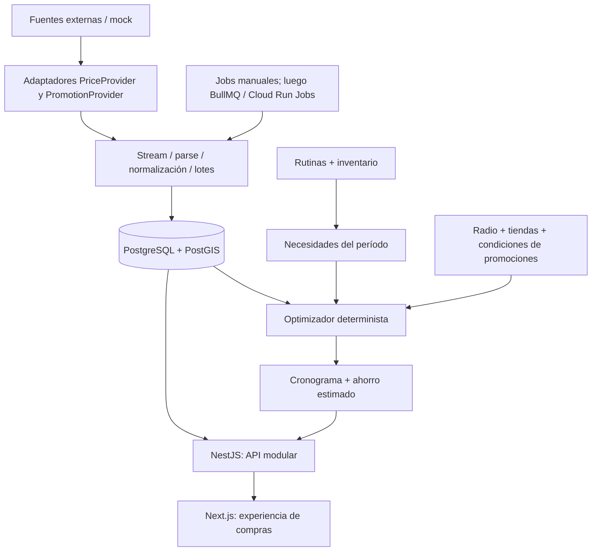

# Arquitectura propuesta

Estado: base acordada para la implementación incremental. El esquema describe el destino; el estado implementado se consulta en `CONTINUAR.md`.

## Objetivo y límites

Ayudar a una persona en Argentina a gastar menos en sus compras habituales. El flujo principal es rutina → necesidad del período → inventario → precios/promociones elegibles → restricciones → cronograma → ahorro estimado. La búsqueda pública es una entrada al producto, no el centro del dominio.

Monorepo con npm workspaces y monolito modular NestJS. Una base PostgreSQL con PostGIS. Next.js App Router consume la API; TanStack Query administra estado remoto del cliente. Redis se incorpora como infraestructura local y se usa efectivamente al introducir BullMQ. Sin servicios independientes ni bus de eventos inicialmente.



## Estructura del monorepo

```text
apps/
  api/
    prisma/schema.prisma
    prisma/migrations/           # P1-02
    prisma.config.ts
    src/
      main.ts
      app.module.ts
      common/                    # errores y configuración HTTP
      config/
      modules/
        health/                  # P1-01
        auth/                    # P1-03
        users/                   # P1-03
        catalog/                 # fase 2
        stores/                  # fase 2
        prices/                  # fases 2, 3 y 6
        routines/                # fase 4
        inventory/               # fase 4
        shopping-plans/          # fase 5
        promotions/              # base P2-03, optimizador fase 5, bancos fase 10
        imports/                 # fase 7
        jobs/                    # fase 8
        alerts/                  # fase 9
  web/
    src/app/                     # rutas App Router
    src/components/
    src/lib/                     # API, query, formatos
packages/
  shared/                        # contratos HTTP seguros; sin Prisma ni secretos
  ui/                            # componentes realmente reutilizados
  config/                        # TypeScript y herramientas
infra/docker/                    # preparación local
docs/
  REQUERIMIENTOS.md
  DOMAIN.md
  ARCHITECTURE.md
  architecture-decisions/
  steps/
ROADMAP.md
CONTINUAR.md
```

Las carpetas de módulos futuros se crean al implementarlos. No se crean servicios vacíos que aparenten funcionalidad.

## Responsabilidades y dependencias

| Módulo | Responsabilidad | No debe hacer |
| --- | --- | --- |
| Auth / users | Identidad, sesiones, preferencias y ownership | Exponer hashes o decidir ofertas |
| Catalog | Producto concreto, equivalencias y categorías | Confundir sustituto con producto exacto |
| Stores | Cadenas, sucursales y distancias | Inventar coordenadas de usuario |
| Prices | Observaciones, precio vigente, historial y análisis | Sobrescribir el historial |
| Routines / inventory | Consumo esperado y existencias declaradas | Descontar inventario por generar un borrador |
| Promotions | Elegibilidad y cálculo de descuentos | Suponer banco/tarjeta o acumulación |
| Shopping plans | Necesidades, optimización y snapshots | Hablar con SEPA o depender de Nest en el algoritmo |
| Imports | Adaptadores, normalización, deduplicación y lotes | Cargar archivos grandes completos en memoria |
| Jobs / alerts | Orquestación, reintentos, notificaciones idempotentes | Duplicar lógica del dominio |

En módulos con reglas usar `domain/` (funciones y tipos puros), `application/` (casos de uso y puertos), `infrastructure/` (Prisma, proveedores) y `presentation/` (controllers/DTO). En health y CRUD sencillo mantener pocos archivos. Dependencias hacia dominio/aplicación; estos no importan adaptadores, decoradores Nest ni el cliente Prisma.

`PriceProvider` y `PromotionProvider` entregan `AsyncIterable` de registros crudos. `PriceImporter`, `PromotionImporter`, `ProductNormalizer` y `PriceNormalizer` orquestan/normalizan mediante contratos de aplicación. Un mock será la primera implementación; SEPA queda como adaptador futuro. Conservar fuente, fecha observada, ingestión y clave de idempotencia. Los contratos concretos se implementan en fase 7, sin pseudocódigo operativo.

## API, cliente y entorno

- API bajo `/api`; endpoints del pedido se agregan a ese prefijo. Fechas ISO, importes y cantidades decimales como strings. IDs UUID. Paginación con límite máximo y orden estable.
- ValidationPipe con whitelist y rechazo de campos desconocidos. DTOs explícitos, errores JSON consistentes, logging JSON sin cuerpos de autenticación ni headers sensibles.
- Web: español argentino, ARS, mobile-first, contraste y foco accesibles. Estados carga/vacío/error/éxito; precio por unidad y antigüedad de la observación visibles.
- PostgreSQL es fuente de verdad. Redis no almacena el único ejemplar de precios, planes ni sesiones.
- Desarrollo: apps ejecutadas en host, PostGIS y Redis en Compose; puertos de datos publicados solamente en loopback. Imágenes de apps y despliegue Cloud Run se harán cuando la app esté funcional.
- Producción: HTTPS, mismo sitio para web/API, secretos externos, pooling de conexiones y migración como tarea única antes de actualizar aplicaciones. No ejecutar migraciones automáticamente por réplica.

## Decisiones y riesgos

| Riesgo o ambigüedad | Decisión / mitigación | Paso |
| --- | --- | --- |
| Disponibilidad, esquema o condiciones de SEPA | Mock primero, adaptadores independientes; verificar acceso real al implementar | P7 |
| Frescos sin EAN y falsos equivalentes | EAN nullable, mapeo explícito y revisión de ambiguos; no unir por nombre solamente | P2/P7 |
| Datos atrasados o sucursales sin stock confirmado | TTL configurable y cobertura explícita; observación no implica stock garantizado | P3/P5 |
| Falta ubicación precisa | Ciudad/provincia; distancia desconocida y sin garantía de radio hasta tener coordenadas | P3/P4 |
| Moneda, redondeos y envases | Decimal; unidades compatibles; paquetes enteros; peso variable explícito | P2/P5 |
| Ofertas por cantidad/banco y topes | Motor básico probado en P2-03; condiciones desconocidas excluidas de ahorro garantizado | P2-03/P5/P10 |
| Combinaciones de tiendas costosas | Búsqueda exacta acotada y fallback determinista identificado | P5 |
| Pérdida de progreso entre modelos | Pasos identificados, criterios verificables, checkpoint obligatorio | Todos |
| Modelo inicial amplio | Migración revisada en P1-02; reglas SQL y de aplicación listadas en DOMAIN | P1-02 |
| Inflación y comparación histórica | Ventana reciente por producto/sucursal/unidad; sin prometer ahorro real | P6 |
| Cuenta, ubicación y sesiones sensibles | Auth probado, mínimo dato, scopes por usuario, logs redactados | P1-03/P4 |

## Referencias de implementación

Se verificaron las guías oficiales para [Next App Router](https://nextjs.org/docs/app/getting-started/installation), [NestJS](https://docs.nestjs.com/) y [adaptadores Prisma](https://www.prisma.io/docs/orm/overview/databases/database-drivers). Las versiones concretas quedan en los manifests y en el lockfile; no actualizar de major al retomar un paso sin revisar compatibilidad.
