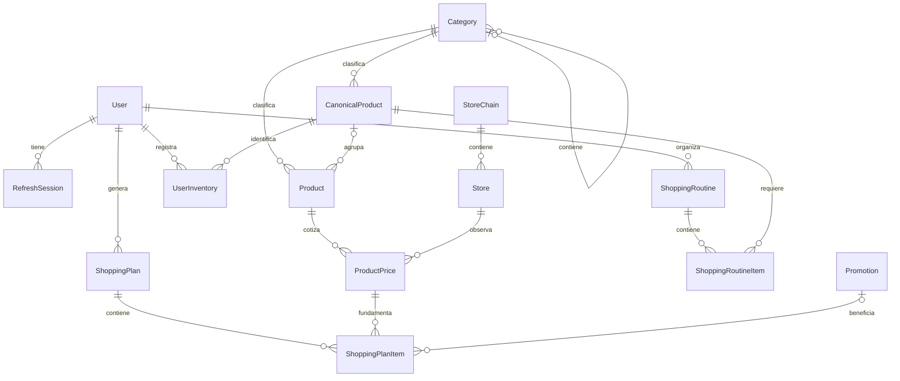

# Modelo de dominio inicial

Estado: diseño para implementación incremental. El archivo `apps/api/prisma/schema.prisma` describe el modelo objetivo; todavía no existen migraciones, datos ni repositorios de estas entidades. Una regla documentada aquí **no está implementada** por el solo hecho de figurar en el documento. Antes de persistir datos se deben agregar las migraciones SQL y validaciones indicadas.

## Responsabilidades y relaciones

| Área | Entidades | Responsabilidad |
| --- | --- | --- |
| Identidad | `User`, `RefreshSession` | Cuenta, preferencias, ubicación opcional y sesiones renovables. |
| Catálogo | `Category`, `CanonicalProduct`, `Product` | Categorías jerárquicas; necesidades equivalentes; presentaciones concretas. |
| Comercios | `StoreChain`, `Store` | Cadena y sucursal; los precios pertenecen a sucursales. |
| Precios | `ProductPrice` | Observaciones históricas inmutables con procedencia. |
| Promociones | `Promotion` | Beneficios con alcance, vigencia y condiciones comprobables. |
| Necesidades | `ShoppingRoutine`, `ShoppingRoutineItem`, `UserInventory` | Consumo recurrente y existencias aproximadas. |
| Planificación | `ShoppingPlan`, `ShoppingPlanItem` | Resultado explicable del optimizador y copia de sus entradas. |



Un producto exacto es una presentación concreta: marca, contenido neto y modalidad de venta. Un canónico agrupa alternativas aceptables, pero no afirma que sean idénticas. La UI debe distinguir `Producto exacto` de `Alternativa`; la pertenencia al mismo canónico por sí sola no habilita sustituciones.

## Dinero, unidades y envases

- Moneda inicial: ARS. Importes finales con `Decimal(14,2)`; precio normalizado con `Decimal(18,6)` para evitar perder precisión antes de calcular el total. La API serializa decimales como cadenas. Los servicios usan aritmética decimal y redondean importes finales, nunca cálculos monetarios con `number` binario.
- `MeasurementUnit` conserva la presentación: `KG`, `G`, `L`, `ML`, `UNIT`. Rutinas, inventario, canónicos y planes usan `BaseUnit`: `KG`, `L`, `UNIT`.
- `1000 G = 1 KG` y `1000 ML = 1 L`. No existe conversión entre masa, volumen y unidades. El precio por 100 g es una presentación de `precioPorKg / 10`, no una nueva dimensión.
- `Product.quantity` representa el contenido total vendido. Un paquete de seis botellas de 2,25 L tiene `quantity=13.5`, `unit=L`, `packageCount=6`; no se vuelve a multiplicar el contenido por seis. Una docena de huevos tiene `quantity=12`, `unit=UNIT`, `packageCount=1`.
- Para `PACKAGED`, `ProductPrice.price` es el precio del paquete completo y se compran paquetes enteros. Si se necesitan 3 L y el envase contiene 2 L, se compran dos envases y el plan registra 4 L.
- Para `VARIABLE_WEIGHT`, `quantity/unit` es la base de cotización, inicialmente 1 KG. El precio efectivo se escala por el peso comprado. La cantidad final es estimada hasta que exista un peso real registrado.
- `ProductPrice.unitPrice = price / contenidoEnUnidadBase`. El importador calcula ambos valores y rechaza cantidades cero, incompatibles o negativas.

El EAN es una cadena opcional para preservar ceros iniciales; se validará longitud y dígito de control al importar. Un producto sin EAN necesita una identidad de proveedor resuelta por el normalizador; no se deduplica solamente por nombre. Cambiar contenido, modalidad de venta o identidad comercial crea otro producto para no reinterpretar precios antiguos.

## Usuarios, ubicación y autenticación

El email se recorta y normaliza a minúsculas antes de persistir. La restricción `@unique` por sí sola es sensible a mayúsculas: la primera migración debe agregar un índice único sobre `lower(email)` o una restricción equivalente. Los hashes de contraseña se calculan con Argon2id según ADR 0003; nunca se guardan contraseñas reversibles.

`RefreshSession` guarda únicamente el hash del refresh token aleatorio. Cada login abre una familia; cada renovación crea un sucesor con la misma familia y marca el anterior como usado. Consumo y creación deben ser atómicos. La reutilización de un token consumido revoca la familia. Se deben probar renovaciones simultáneas y replay antes de habilitar auth. No registrar tokens, hashes ni contraseñas en logs.

La ubicación puede omitirse. Ciudad/provincia permiten una búsqueda aproximada, pero no justifican informar distancias o aplicar un radio como si existieran coordenadas. Sin ubicación precisa, el plan indica que no pudo verificar distancia; no inventa `0 km`. `maxStoresPerShoppingPlan=null` significa sin límite comercial; el optimizador debe limitar su espacio de búsqueda de manera documentada.

`Store.location` prepara `geography(Point,4326)` para PostGIS. La migración debe instalar la extensión antes de crear la tabla, agregar índice GiST y sincronizar el punto con latitud/longitud. `ST_MakePoint` recibe **longitud, latitud**. Las búsquedas usarán SQL parametrizado y `ST_DWithin` en metros. Prisma no administra directamente el campo `Unsupported`. Inicialmente latitud/longitud son el dato de entrada; el punto se deriva de ellas.

## Historia de precios e importación

`ProductPrice` es una observación, no el estado mutable del producto. El repositorio inserta; no actualiza el precio anterior. `observedAt` describe cuándo se observó el precio; `ingestedAt`, cuándo entró al sistema. `source` identifica un adaptador, sin enum cerrado ni campos específicos de SEPA.

`@@unique([source, idempotencyKey])` evita repetir una observación en reintentos. La clave se deriva de la identidad estable del evento de origen, incluyendo producto, sucursal y fecha cuando el proveedor no entrega un ID único. No usar solamente producto+sucursal: eso eliminaría el historial. Un reintento con misma clave y distinto contenido es un conflicto que se registra; no sobrescribe una observación. `importBatchId` permite rastrear una ejecución sin introducir una plataforma de importaciones antes de necesitarla.

La primera migración debe reforzar append-only con permisos del rol de aplicación o trigger que rechace `UPDATE`/`DELETE`. Los mecanismos de corrección y retención se diseñarán antes de importar fuentes reales. Los precios vencidos no equivalen a disponibilidad garantizada: la aplicación debe definir una antigüedad máxima y mostrar fecha/fuente. La consulta del precio actual debe resolver empates de fuentes y fechas de manera determinista.

Promedios y mínimos se calculan para el mismo producto, sucursal y unidad. La futura política histórica debe evitar que diez importaciones en un día pesen diez veces más que un día con una sola; usar cierre diario y declarar días con datos. Sin muestra suficiente se informa `datos insuficientes`, no una oferta verificada.

## Promociones y elegibilidad

Una promoción apunta a **una sucursal o una cadena**, nunca ambas. Puede apuntar a un producto, a un canónico o a todo su alcance comercial; no a producto y canónico a la vez. La vigencia es `[validFrom, validUntil)`. Días de aplicación y fechas de compra se interpretan en `America/Argentina/Buenos_Aires`; timestamps se guardan con zona en PostgreSQL.

| Tipo | Semántica inicial |
| --- | --- |
| `PERCENTAGE` | Porcentaje sobre las unidades elegibles. |
| `SECOND_UNIT` | Porcentaje de descuento sobre una unidad por cada par completo del mismo producto. |
| `TWO_FOR_ONE` | Unidades cobradas = `cantidad - floor(cantidad / 2)` del mismo producto. |
| `FIXED_PRICE` | Precio final por unidad de venta al alcanzar `requiredQuantity`, si se exige un mínimo. |
| `BANK_DISCOUNT` | Porcentaje sujeto a banco, medio de pago, mínimo y tope informados. |

Estas fórmulas describen la implementación futura; no existe motor promocional todavía. Las promociones por pares inicialmente solo soportan paquetes enteros del mismo SKU. Combinaciones entre productos, acumulación y beneficios ambiguos se excluyen del cálculo automático hasta implementarlos explícitamente.

`eligibleWeekdays=[]` permite todos los días. `minimumSpend` se evalúa sobre el subtotal elegible de la compra en una sucursal. `discountCap` limita el beneficio; `capPeriod` distingue compra, semana, mes y campaña. Para topes que abarcan varias compras hace falta conocer el beneficio ya utilizado: hasta tener ese estado no se debe prometer el descuento como ahorro garantizado. `terms` es texto informativo, nunca código ejecutable ni una condición que el planificador pueda inferir por sí mismo.

Banco, medio de pago y membresía deben coincidir con las preferencias declaradas por el usuario. Preferencias vacías no significan elegibilidad universal. `isStackable=false` es el valor inicial; `true` tampoco habilita acumulación hasta definir compatibilidades. El precio regular queda en `ProductPrice`; una promoción no reescribe la historia.

## Rutinas e inventario

`frequencyDays` y `anchorDate` representan intervalos reales de calendario. Semanal = 7; cada 15 días = 15. Se evita dividir por cuatro para interpretar un mes. El ítem hereda frecuencia y ancla de su rutina si ambos campos son nulos; si los reemplaza, debe proveer ambos. `quantity` es la necesidad por ocurrencia. El generador cuenta ocurrencias entre las fechas inclusivas del plan y multiplica la cantidad; agrupa el mismo canónico de varias rutinas antes de restar el inventario una sola vez.

Una rutina contiene como máximo un ítem por canónico. El producto preferido debe pertenecer a ese canónico y tener una dimensión compatible. Si `allowSubstitutes=false`, es obligatorio elegir un producto preferido. Las marcas excluidas son restricciones; las preferidas son preferencias, y no pueden aparecer en ambas listas.

El inventario almacena un saldo aproximado, no lotes ni vencimientos. Hay una fila por usuario y canónico y su unidad debe coincidir con la del canónico. Necesidad neta = `max(0, necesidad - inventario)`. Generar un plan no consume inventario ni acredita una compra. Automatizar movimientos requiere una acción confirmada e idempotente del usuario en una etapa posterior.

## Planes, optimización y ahorro

El optimizador será determinista. Primero calcula necesidades netas y candidatos elegibles; luego respeta cantidades de envases, promociones, distancia y máximo de sucursales. Un resultado con faltantes los conserva en `unfulfilledNeeds`; nunca compara una canasta parcial con una completa para exhibir ahorro.

La función inicial es aditiva y expresa todas las penalizaciones en ARS:

```text
effectiveCost = optimizedCost + storeVisitPenaltyCost + distancePenaltyCost
storeVisitPenaltyCost = cantidadDeVisitas * storeVisitPenalty
distancePenaltyCost = distanciaEstimadaKm * distancePenaltyPerKm
estimatedSavings = estimatedRegularCost - optimizedCost
```

Los valores por defecto de penalizaciones son cero; se pueden configurar y deben aparecer en el snapshot. Una visita se identifica por sucursal/fecha: ir a la misma sucursal dos días cuenta como dos visitas, aunque sea una sola sucursal para el límite de comercios. La distancia inicial estima ida y vuelta desde el origen por visita según ADR 0004; no es una ruta vial real. `effectiveCost` decide la recomendación; el ahorro mostrado distingue dinero de productos de penalizaciones de conveniencia. No se transforma una penalización en gasto real.

El costo habitual requiere una referencia explícita: `baselineMethod` registra la política aplicada sobre la misma necesidad cubierta, cantidades de envases y horizonte. Según ADR 0004, la base inicial es una canasta elegible en una sola sucursal con cobertura completa. Si no existe, cualquier otro método debe documentarse antes de aplicarlo; sin una canasta comparable el generador no inventa un ahorro. El algoritmo busca exactamente sobre candidatos acotados y utiliza un fallback determinista identificado si supera su presupuesto computacional; `optimizerVersion` identifica la versión. No se debe prometer un óptimo global si la búsqueda fue limitada.

`ShoppingPlanItem.neededQuantity` representa la necesidad; `quantity`, lo realmente recomendado después de redondear envases; `packageCount`, los paquetes a comprar. `price` y `estimatedRegularPrice` son **totales de línea**, no precios unitarios. La asignación de descuentos de carrito a líneas debe preservar el total y usar una regla de redondeo determinista.

El plan guarda `inputSnapshot` con las preferencias, rutinas, existencias, fecha de corte y reglas usadas. Cada línea referencia su observación de precio y mantiene un `snapshot` con nombres, presentación, procedencia, fecha y condiciones promocionales relevantes. Los JSON deben tener `schemaVersion` y validación en la aplicación; no incluyen credenciales. Editar una rutina, una marca o una promoción después no modifica un plan emitido.

Los estados iniciales son `DRAFT`, `ACTIVE`, `COMPLETED` y `EXPIRED`. Pasar a completado requiere una acción del usuario. No hay comprobantes ni registro de gasto real en este modelo: los indicadores del dashboard son **ahorro estimado** y deben etiquetarse así. Sumar planes regenerados o superpuestos puede duplicar ahorro; la implementación debe seleccionar la versión activa/completada válida por período.

## Integridad pendiente de implementación

Prisma expresa claves primarias, relaciones, unicidad e índices declarados. Las siguientes reglas requieren migraciones y/o aplicación, y se verificarán antes de habilitar cada módulo:

| Regla | Lugar de implementación |
| --- | --- |
| Email normalizado y unicidad sin distinguir mayúsculas | Aplicación + índice SQL. |
| Coordenadas completas o ambas nulas; latitud entre -90 y 90, longitud entre -180 y 180 | `CHECK` SQL + DTO. |
| Radio positivo, máximo de sucursales positivo o nulo; penalizaciones no negativas | `CHECK` SQL + DTO. |
| Cantidades, precio, precio normalizado y tamaño de envase positivos; inventario no negativo | `CHECK` SQL + dominio. |
| Moneda ARS inicial y consistencia de unidad normalizada | `CHECK` SQL para moneda; dominio para conversión. |
| Árbol de categorías sin ciclos | Aplicación transaccional; `parentId != id` también en SQL. |
| Dimensión compatible entre producto, canónico, inventario y rutinas | Dominio; relaciones simples no comparan unidades. |
| Observaciones inmutables y clave de importación estable | Trigger/permisos SQL + importador. |
| Punto geográfico, coordenadas e índice GiST consistentes | Migración SQL. |
| Exactamente un alcance comercial y como máximo un alcance de producto por promoción | `CHECK` SQL + DTO. |
| Vigencia positiva, porcentaje en `(0,100]`, mínimos/topes válidos y días ISO sin duplicados | SQL cuando sea posible + validador del dominio. |
| Campos promocionales coherentes con el tipo, y tope/período presentes juntos | `CHECK` SQL + dominio. |
| Intervalo de rutina positivo y reemplazo conjunto de frecuencia/ancla | `CHECK` SQL + dominio. |
| Preferido del canónico correcto y obligatorio cuando no hay sustituciones | Dominio. |
| Fechas del plan ordenadas; cantidades recomendadas suficientes; sumas monetarias coherentes | SQL simple + servicio de generación transaccional. |
| Precio/producto/sucursal y promoción de una línea consistentes | Servicio de generación; FK individuales no lo garantizan. |
| Aislamiento entre usuarios en rutinas, inventario y planes | Autorización en todos los casos de uso; UUID no es permiso. |
| Rotación de refresh sin carreras y revocación familiar | Transacción + tests de integración de auth. |

Los borrados de catálogo, comercios, precios y promociones referenciados están restringidos para conservar trazabilidad; productos y sucursales pueden desactivarse. Borrar una cuenta elimina sus sesiones, rutinas, inventario y planes por cascada. Esa operación no existe aún y requerirá un caso de uso explícito, sin borrar historia comercial compartida.

## Próxima acción sobre este modelo

Validar y generar el cliente con la versión de Prisma fijada en el repositorio. En el step de base de datos, crear una migración revisable que habilite PostGIS, cree tablas, agregue las restricciones anteriores y se pruebe en una base vacía. No usar `db push` como sustituto de esas migraciones. Agregar seeds e integración de PostgreSQL después, sin afirmar que la base está lista solo porque `prisma validate` termina correctamente.
